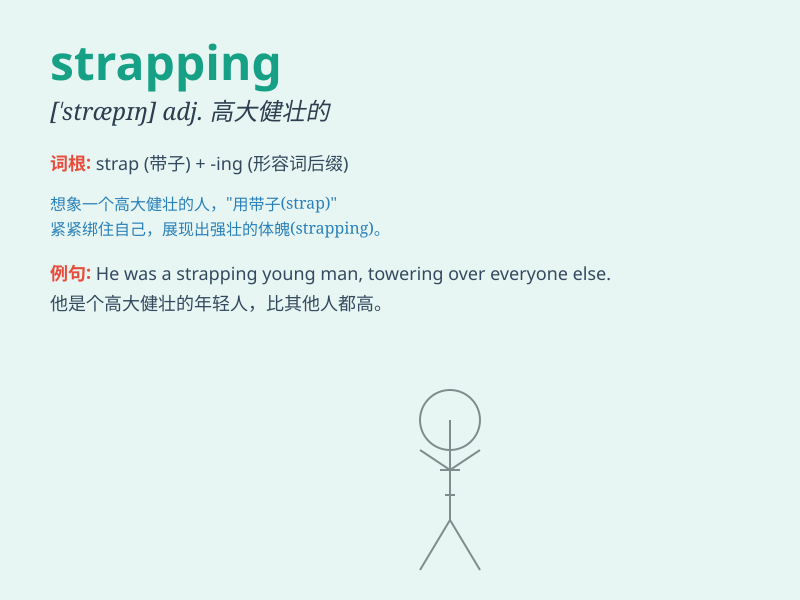

## strapping

**英音:** _[\'stræpɪŋ]_ **美音:** _[\'stræpɪŋ]_

**译义:** *adj.伟岸的,魁梧的,身材高大健壮的n.皮带材料,橡皮膏*

### 短语

+ **strapping young man:** _高大健壮的年轻人_

+ **strapping lad:** _高大结实的小伙子_

+ **strapping build:** _高大健壮的体格_

+ **strapping figure:** _高大挺拔的身材_

+ **strapping strength:** _强大的力量_

### 例句

#### 例句1

> **He is a strapping young man.**

**中文翻译:** 他是一个高大健壮的年轻人。

**单词释义:** 高大健壮的

#### 例句2

> **The strapping athlete won the championship easily.**

**中文翻译:** 这位强壮的运动员轻松赢得了冠军。

**单词释义:** 强壮的

#### 例句3

> **She was attracted by the strapping soldier.**

**中文翻译:** 她被那个魁梧的士兵吸引住了。

**单词释义:** 魁梧的

### 背诵小故事

> There was a strapping young man in the village. He was very tall and
strong. He could carry heavy things easily. People called him \'the
strapping hero\'.

**在村子里有一个身材魁梧的年轻人。他又高又壮。他能轻松搬运重物。人们称他为'身材魁梧的英雄'。**

### 图义

