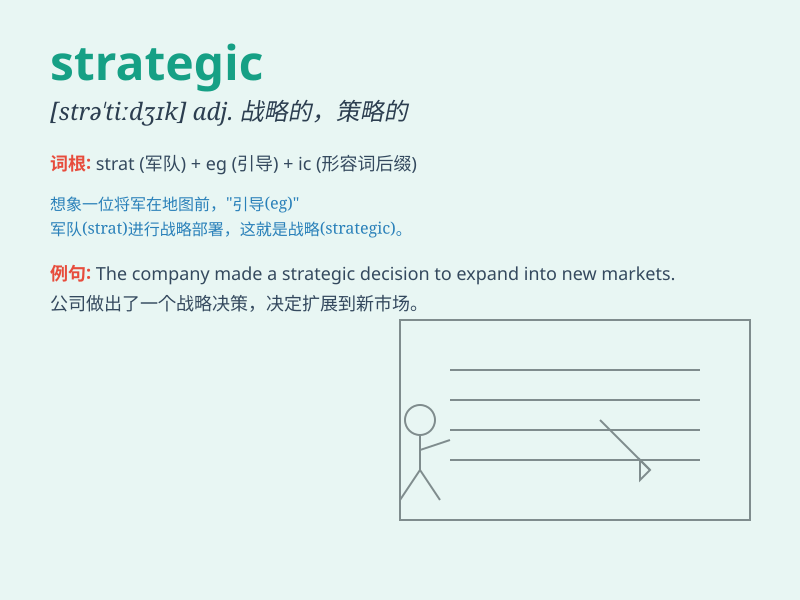

## strategic

**英音:** _[strə\'tiːdʒɪk]_ **美音:** _[strə\'tidʒɪk]_

**译义:** *adj.战略的,战略上的*

### 短语

+ **strategic planning:** _战略规划_

+ **strategic alliance:** _战略联盟_

+ **strategic location:** _战略位置_

+ **strategic decision:** _战略决策_

+ **strategic objective:** _战略目标_

### 例句

#### 例句1

> **The company made a strategic decision to expand its business
overseas.**

**中文翻译:** 这家公司做出了一个战略性的决定，要将业务拓展到海外。

**单词释义:** 战略性的

#### 例句2

> **The general planned a strategic move to outflank the enemy.**

**中文翻译:** 将军策划了一个战略行动以包抄敌人。

**单词释义:** 战略的

#### 例句3

> **This location has strategic importance for military
operations.**

**中文翻译:** 这个位置对于军事行动具有战略重要性。

**单词释义:** 战略上重要的

### 背诵小故事

> A general was planning a battle. He carefully considered every move,
thinking about where to place troops and how to attack. This was all
part of his strategic thinking. Strategic means important for achieving
a long-term goal, like winning the war.

**一位将军正在规划一场战役。他仔细考虑每一步，思考在哪里部署军队以及如何进攻。这都是他的战略思考。Strategic
意思是对实现长期目标很重要，比如赢得战争。**

### 图义

