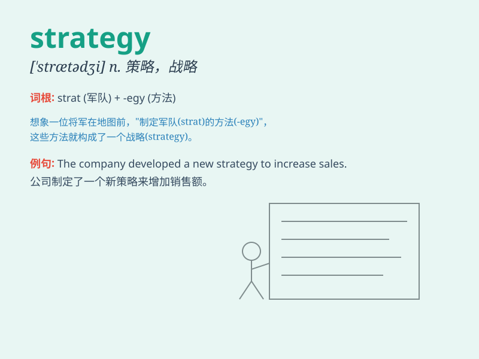

## strategy

**英音:** _[ˈstrætədʒɪ]_ **美音:** _[\'strætədʒi]_

**译义:** *n.策略,军略*

### 短语

+ **marketing strategy:** _营销策略_

+ **business strategy:** _商业策略_

+ **global strategy:** _全球战略_

+ **defensive strategy:** _防御策略_

+ **offensive strategy:** _进攻策略_

### 例句

#### 例句1

> **The company needs to develop a new marketing strategy to increase
sales.**

**中文翻译:** 公司需要制定一个新的营销策略来增加销售额。

**单词释义:** 策略；战略

#### 例句2

> **His strategy for dealing with stress is to exercise
regularly.**

**中文翻译:** 他应对压力的策略是定期锻炼。

**单词释义:** 策略；方法

#### 例句3

> **The football team\'s strategy worked perfectly and they won the
game.**

**中文翻译:** 这支足球队的战略非常奏效，他们赢得了比赛。

**单词释义:** 战略；战术

### 背诵小故事

> A general was leading his army. Before the battle, he spent hours
thinking and planning. His careful thought and plan were his strategy to
win. With a good strategy, they finally won the war.

**一位将军正在领导他的军队。在战斗之前，他花了数小时思考和规划。他的精心思考和计划就是他获胜的策略。凭借良好的策略，他们最终赢得了战争。**

### 图义

