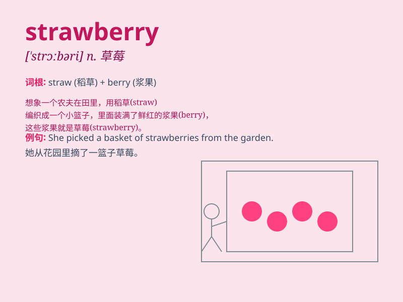

## strawberry

**英音:** _[\'strɔːb(ə)rɪ]_ **美音:** _[\'strɔbɛri]_

**译义:** *n.[植]草莓*

### 短语

+ **strawberry jam:** _草莓果酱_

+ **strawberry ice cream:** _草莓冰淇淋_

+ **strawberry shortcake:** _草莓酥饼_

+ **wild strawberry:** _野草莓_

+ **strawberry field:** _草莓地_

### 例句

#### 例句1

> **I love strawberries because they are sweet and juicy.**

**中文翻译:** 我喜欢草莓，因为它们又甜又多汁。

**单词释义:** 草莓（复数形式）

#### 例句2

> **She picked some fresh strawberries from the garden.**

**中文翻译:** 她从花园里摘了一些新鲜的草莓。

**单词释义:** 草莓（复数形式）

#### 例句3

> **The strawberry cake looks delicious.**

**中文翻译:** 这个草莓蛋糕看起来很美味。

**单词释义:** 草莓

### 背诵小故事

> A little girl went to a farm and saw many strawberries. They were as
red as rubies. She picked one and tasted it. It was so sweet! She
decided to bring some home to share with her friends.

**一个小女孩去了农场，看到了许多草莓。它们像红宝石一样红。她摘了一个尝了尝。太甜了！她决定带一些回家和朋友们分享。**

### 图义

