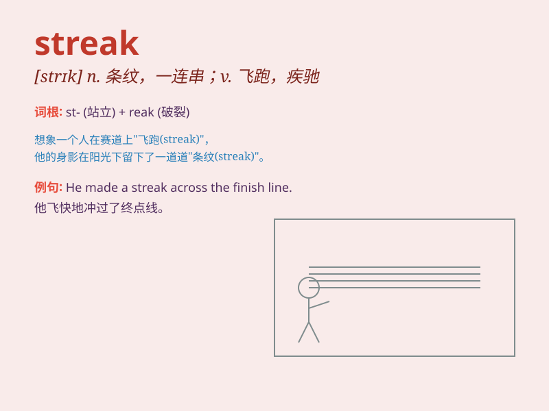

## streak

**英音:** _[striːk]_ **美音:** _[strik]_

**译义:** *v.飞跑,加上条纹*

### 短语

+ **winning streak:** _连胜_

+ **losing streak:** _连败_

+ **streak of lightning:** _闪电光带_

+ **streak of bad luck:** _一连串的厄运_

+ **have a streak of independence:** _有独立的倾向_

### 例句

#### 例句1

> **She had a streak of bad luck last month.**

**中文翻译:** 她上个月运气一直不好。

**单词释义:** 一系列；一连串

#### 例句2

> **The horse has a white streak down its back.**

**中文翻译:** 这匹马背上有一条白色的条纹。

**单词释义:** 条纹；条痕

#### 例句3

> **He has a competitive streak and always wants to win.**

**中文翻译:** 他有争强好胜的性格，总是想赢。

**单词释义:** 性格特点；倾向

### 背诵小故事

> One day, Tom saw a shooting star with a bright streak across the sky.
He made a wish and hoped his good luck would continue like that streak.
Later, he won a game and knew his lucky streak had begun.

**一天，汤姆看到一颗流星带着明亮的光带划过天空。他许了个愿，希望自己的好运能像那道光带一样持续下去。后来，他赢得了一场比赛，知道自己的好运开始了。**

### 图义

