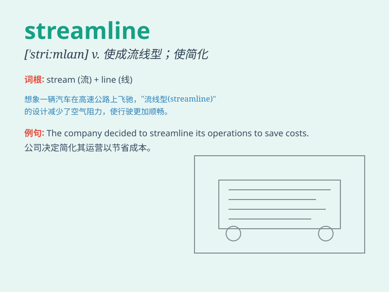

## streamline

**英音:** _[\'striːmlaɪn]_ **美音:** _[\'strimlaɪn]_

**译义:** *adj.流线型的*

### 短语

+ **streamline process:** _精简流程_

+ **streamline design:** _流线型设计_

+ **streamline operation:** _优化运营_

+ **streamline structure:** _简化结构_

+ **streamline management:** _精简管理_

### 例句

#### 例句1

> **The company is trying to streamline its production process to
increase efficiency.**

**中文翻译:** 这家公司正试图精简其生产流程以提高效率。

**单词释义:** 精简；使合理化

#### 例句2

> **The new design will streamline the appearance of the car.**

**中文翻译:** 新的设计将使汽车的外观更具流线型。

**单词释义:** 使成流线型

#### 例句3

> **We need to streamline our administrative procedures to save
time.**

**中文翻译:** 我们需要简化我们的行政程序以节省时间。

**单词释义:** 简化；使效率更高

### 背诵小故事

>
想象一下，一条小溪（stream）流淌着，水中的杂物阻碍了水流。但突然来了一位神奇的工匠，他巧妙地清除杂物，让水流变得顺畅如线（line）。这就是\'streamline\'，使变得流畅高效。

**想象小溪因杂物阻碍水流，工匠清除杂物使其顺畅如线来记住\'streamline\'表示使变得流畅高效**

### 图义

