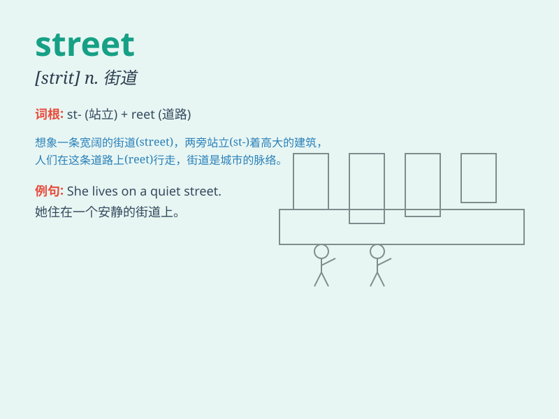

## street

**英音:** _[striːt]_ **美音:** _[strit]_

**译义:** *n.街,街道*

### 短语

+ **street lamp:** _路灯_

+ **street vendor:** _街头小贩_

+ **street corner:** _街角_

+ **street art:** _街头艺术_

+ **high street:** _主要街道；商业街_

### 例句

#### 例句1

> **I met him on the street yesterday.**

**中文翻译:** 我昨天在街上遇见了他。

**单词释义:** 街道

#### 例句2

> **The street was crowded with people and cars.**

**中文翻译:** 这条街道挤满了人和车。

**单词释义:** 街道

#### 例句3

> **She lives in a quiet street.**

**中文翻译:** 她住在一条安静的街道上。

**单词释义:** 街道

### 背诵小故事

> One day, a little girl was lost in a strange place. She was crying on
the street. A kind policeman came and helped her find her way home. The
street was full of people and cars, but finally, the girl was safe.

**一天，一个小女孩在一个陌生的地方迷路了。她在街上哭泣。一位善良的警察来了，并帮助她找到了回家的路。这条街道上满是人和车，但最后，女孩安全了。**

### 图义

