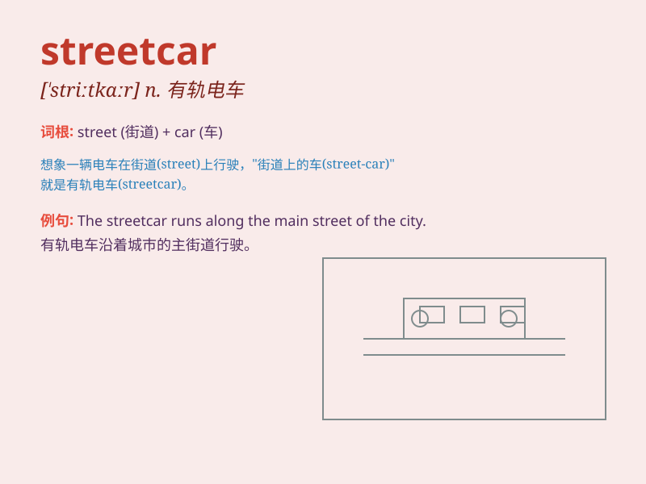

## streetcar

**英音:** _[\'striːtkɑː]_ **美音:** _[\'stritkɑr]_

**译义:** *n.路面电车*

### 短语

+ **streetcar line:** _有轨电车线路_

+ **streetcar stop:** _有轨电车站_

+ **streetcar track:** _有轨电车轨道_

+ **old streetcar:** _老式有轨电车_

+ **modern streetcar:** _现代有轨电车_

### 例句

#### 例句1

> **The streetcar rumbled along the tracks.**

**中文翻译:** 有轨电车沿着轨道隆隆作响。

**单词释义:** 有轨电车

#### 例句2

> **We took the streetcar to the city center.**

**中文翻译:** 我们乘坐有轨电车去市中心。

**单词释义:** 有轨电车

#### 例句3

> **The old streetcar was restored and put back into service.**

**中文翻译:** 那辆旧的有轨电车被修复并重新投入使用。

**单词释义:** 有轨电车

### 背诵小故事

> One day, I was walking along the street when a streetcar passed by
with a clang. I was fascinated by its big wheels and the people inside.
It moved smoothly along the rails on the street. Remember, a streetcar
is a vehicle for transportation on city streets.

**有一天，我正沿着街道走，一辆有轨电车哐当哐当地驶过。我被它的大轮子和里面的人吸引了。它沿着街道上的铁轨平稳地移动。记住，streetcar
就是城市街道上的一种交通工具。**

### 图义

