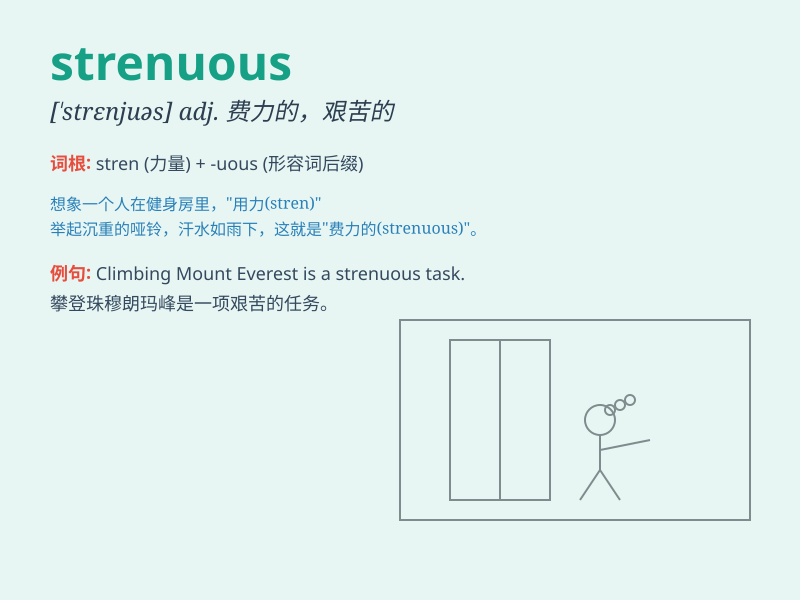

## strenuous

**英音:** _[\'strenjʊəs]_ **美音:** _[\'strɛnjuəs]_

**译义:** *adj.奋发的,使劲的,紧张的,热烈的,艰辛发奋的*

### 短语

+ **strenuous exercise:** _剧烈运动_

+ **strenuous effort:** _艰苦的努力_

+ **strenuous task:** _艰巨的任务_

+ **strenuous climb:** _费力的攀登_

+ **strenuous work:** _繁重的工作_

### 例句

#### 例句1

> **The hike was very strenuous, but the view from the top was worth
it.**

**中文翻译:** 这次徒步旅行非常费力，但山顶的景色值得。

**单词释义:** 费力的；艰苦的

#### 例句2

> **He has been doing strenuous exercise to build up his
strength.**

**中文翻译:** 他一直在进行艰苦的锻炼以增强体力。

**单词释义:** 剧烈的；繁重的

#### 例句3

> **The strenuous work schedule left her exhausted at the end of the
week.**

**中文翻译:** 紧张繁重的工作日程让她在周末精疲力竭。

**单词释义:** 紧张的；费力的

### 背诵小故事

> A little ant was trying to move a big crumb. It was a strenuous task.
But the ant didn\'t give up. It kept pulling and pushing with all its
strength. Finally, it succeeded.

**一只小蚂蚁试图移动一块大面包屑。这是一项艰巨的任务。但蚂蚁没有放弃。它一直用尽全身力气推拉。最终，它成功了。**

### 图义

