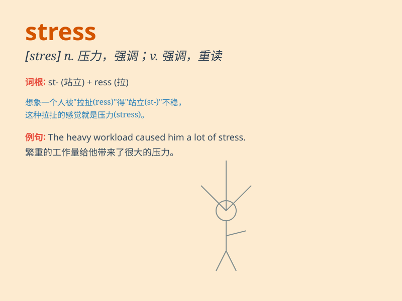

## stress

**英音:** _[stres]_ **美音:** _[strɛs]_

**译义:** *n.重压,逼迫,压力,重点,着重,强调,重音vt.着重,强调,重读*

### 短语

+ **stress out:** _极度焦虑；紧张_

+ **under stress:** _在压力之下_

+ **stress management:** _压力管理_

+ **stress fracture:** _应力性骨折_

+ **emotional stress:** _情绪压力_

### 例句

#### 例句1

> **She\'s under a lot of stress because of her new job.**

**中文翻译:** 由于她的新工作，她承受着很大的压力。

**单词释义:** 压力

#### 例句2

> **The doctor warned him about the stress on his heart.**

**中文翻译:** 医生警告他要注意心脏所承受的压力。

**单词释义:** 压力；重压

#### 例句3

> **You need to find ways to reduce stress in your life.**

**中文翻译:** 你需要找到减轻生活中压力的方法。

**单词释义:** 压力；紧张

### 背诵小故事

> A little ant was carrying a big piece of food, feeling very stressed.
It struggled along the way, worried about not reaching the nest in time.
Just like us when facing too many tasks or difficulties, we feel stress.

**一只小蚂蚁正驮着一大块食物，感到压力非常大。它一路上艰难前行，担心不能及时回到巢穴。这就像我们面对太多任务或困难时，会感到有压力。**

### 图义

