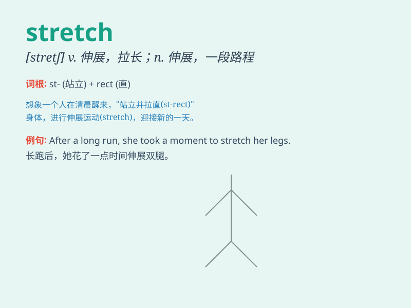

## stretch

**英音:** _[stretʃ]_ **美音:** _[strɛtʃ]_

**译义:** *v.伸展,伸长n.一段时间,一段路程,伸展*

### 短语

+ **stretch out:** _伸展；伸手；躺直_

+ **stretch for:** _延伸；长达_

+ **at a stretch:** _一口气地；连续不断地_

+ **stretch one\'s legs:** _（久坐后）散步，活动活动腿脚_

+ **stretch the truth:** _夸大其词；言过其实_

### 例句

#### 例句1

> **I like to stretch my legs after a long day at work.**

**中文翻译:** 在工作了一整天之后，我喜欢伸展一下双腿。

**单词释义:** 伸展；舒展

#### 例句2

> **The desert stretched as far as the eye could see.**

**中文翻译:** 沙漠一直延伸到视线所能及的地方。

**单词释义:** 延伸；绵延

#### 例句3

> **This sweater will stretch if you pull it too hard.**

**中文翻译:** 这件毛衣如果你用力拉它会被拉长。

**单词释义:** 拉长；撑大

### 背诵小故事

>
想象一只长颈鹿在草原上，它努力伸直脖子去够高高的树叶，那长长的脖子不断地stretch。它的身体也尽力向前伸展，想要吃到更多美味的叶子。

**想象一只长颈鹿在草原上努力伸直脖子和身体去够树叶，以此来辅助记忆'stretch'（伸展、拉长）这个单词。**

### 图义

