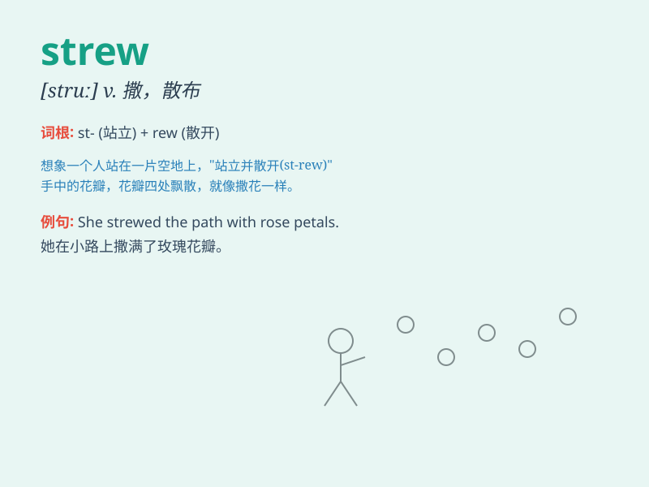

## strew

**英音:** _[struː]_ **美音:** _[struː]_

**译义:** *vt.散播,点缀,撒满*

### 短语

+ **strew about:** _到处乱扔；四处散布_

+ **strew with:** _用\...撒满；布满_

+ **strew flowers:** _撒花_

+ **strew leaves:** _撒树叶_

+ **strew the path:** _撒满道路_

### 例句

#### 例句1

> **The wind strewed the leaves all over the ground.**

**中文翻译:** 风把树叶吹得满地都是。

**单词释义:** 撒；散播

#### 例句2

> **She strewed flowers on the grave.**

**中文翻译:** 她在坟墓上撒了花。

**单词释义:** 撒；散布

#### 例句3

> **The room was strewed with toys.**

**中文翻译:** 房间里到处都是玩具。

**单词释义:** 布满；撒满

### 背诵小故事

> A naughty monkey climbed into a fruit store and strewed the apples
everywhere. The owner was very angry. Remember, \'strew\' means to
scatter or spread things carelessly.

**一只顽皮的猴子爬进了一家水果店，把苹果到处乱丢。店主非常生气。记住，'strew'意思是随意撒或散布东西。**

### 图义

