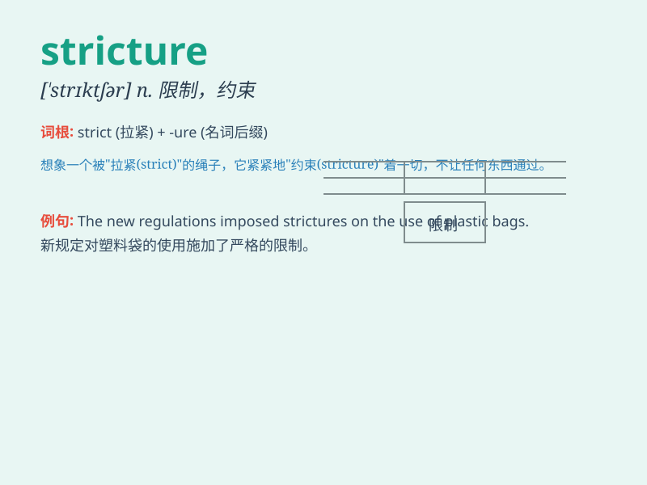

## stricture

**英音:** _[\'strɪktʃə]_ **美音:** _[\'strɪktʃɚ]_

**译义:** *n.责难*

### 短语

+ **impose strictures:** _施加限制_

+ **under stricture:** _处于限制之下_

+ **escape stricture:** _逃脱限制_

+ **relax strictures:** _放宽限制_

+ **face strictures:** _面临限制_

### 例句

#### 例句1

> **The doctor diagnosed a stricture in the patient\'s artery.**

**中文翻译:** 医生诊断出病人的动脉有狭窄。

**单词释义:** 狭窄；缩窄

#### 例句2

> **The company faced strictures from the regulatory authorities for
its business practices.**

**中文翻译:** 该公司因其商业行为面临监管机构的责难。

**单词释义:** 责难；非难

#### 例句3

> **Her speech was full of strictures against the current political
system.**

**中文翻译:** 她的演讲充满了对当前政治制度的抨击。

**单词释义:** 抨击；指责

### 背诵小故事

> A doctor was explaining to a patient that a stricture in their blood
vessel was like a narrow passage. It was restricting the normal flow,
just like a tight door in a hallway. The patient finally understood the
problem.

**一位医生向病人解释，血管中的狭窄就像一条狭窄的通道。它限制了正常的血流，就像走廊里的一扇紧闭的门。病人终于明白了这个问题。**

### 图义

