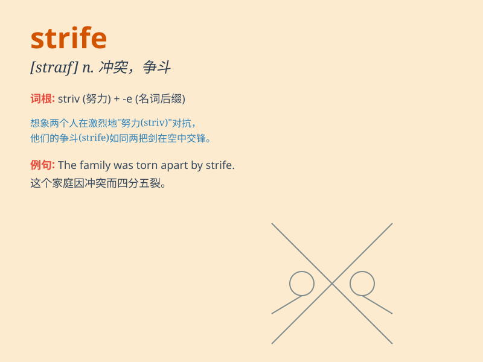

## strife

**英音:** _[straɪf]_ **美音:** _[straɪf]_

**译义:** *n.斗争,冲突,竞争*

### 短语

+ **domestic strife:** _家庭纠纷_

+ **political strife:** _政治纷争_

+ **internecine strife:** _自相残杀的争斗_

+ **endless strife:** _无休止的冲突_

+ **social strife:** _社会冲突_

### 例句

#### 例句1

> **The country was torn apart by political strife.**

**中文翻译:** 这个国家因政治冲突而分崩离析。

**单词释义:** 冲突；争斗；纠纷

#### 例句2

> **There was constant strife between the two teams.**

**中文翻译:** 这两个队之间不断有冲突。

**单词释义:** 冲突；争吵

#### 例句3

> **Family strife made him very unhappy.**

**中文翻译:** 家庭纠纷使他很不开心。

**单词释义:** 纠纷；争吵

### 背诵小故事

> In a small village, there was constant strife between two families
over land. They argued and fought every day. But finally, they realized
peace was better and ended the strife.

**在一个小村庄里，有两家人因为土地问题一直存在纷争。他们每天争吵和打斗。但最终，他们意识到和平更好，结束了纷争。**

### 图义

