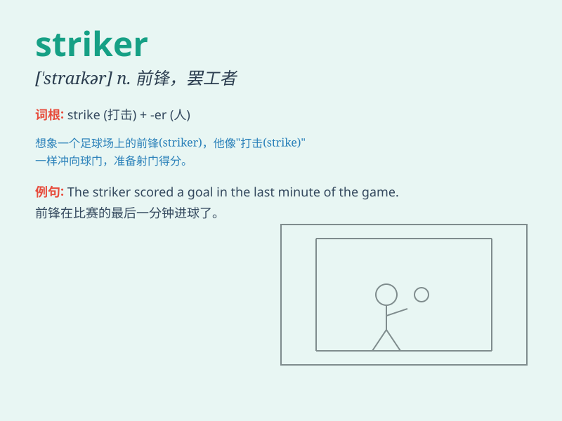

## striker

**英音:** _[\'straɪkə]_ **美音:** _[\'straɪkɚ]_

**译义:** *n.打击者,罢工者,钟锤,叉鱼的人*

### 短语

+ **front striker:** _前锋_

+ **strike out:** _删去；划掉_

+ **strike up:** _开始（谈话、相识等）_

+ **strike down:** _击倒；打倒_

+ **general striker:** _普通前锋_

### 例句

#### 例句1

> **The striker scored a brilliant goal in the final minute of the
game.**

**中文翻译:** 这位前锋在比赛的最后一分钟打进了一个精彩的进球。

**单词释义:** 前锋

#### 例句2

> **The factory workers went on strike and the strikers demanded
better working conditions.**

**中文翻译:** 工厂工人举行了罢工，罢工者要求更好的工作条件。

**单词释义:** 罢工者

#### 例句3

> **The striker was known for his powerful kicks.**

**中文翻译:** 这位前锋以他强有力的踢球而闻名。

**单词释义:** 前锋

### 背诵小故事

> A striker in a football game was very determined. He practiced hard
every day, aiming to score goals. Finally, in a crucial match, he became
the hero by scoring the winning goal. Remember, a striker is someone who
attacks to score.

**在一场足球比赛中，有个前锋非常坚定。他每天努力训练，目标是进球。最终，在一场关键比赛中，他通过打进决胜球成为了英雄。记住，striker
就是进攻得分的人。**

### 图义

