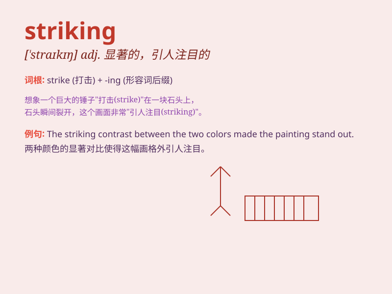

## striking

**英音:** _[\'straɪkɪŋ]_ **美音:** _[\'straɪkɪŋ]_

**译义:** *adj.打击的,显著的,惊人的,罢工的*

### 短语

+ **striking contrast:** _显著的对比_

+ **striking feature:** _显著特点_

+ **striking resemblance:** _惊人的相似_

+ **striking beauty:** _惊人的美_

+ **striking example:** _突出的例子_

### 例句

#### 例句1

> **The woman\'s striking beauty caught everyone\'s attention.**

**中文翻译:** 这位女士惊人的美貌吸引了每个人的注意。

**单词释义:** 惊人的

#### 例句2

> **The contrast between black and white is very striking.**

**中文翻译:** 黑与白的对比非常显著。

**单词释义:** 显著的

#### 例句3

> **The new building has a striking design.**

**中文翻译:** 新建筑有一个引人注目的设计。

**单词释义:** 引人注目的

### 背诵小故事

> A thief was running in the street. Suddenly, a superhero appeared
with a striking costume. His powerful punch stopped the thief
immediately. The scene was so impressive and memorable.

**一个小偷在街上跑。突然，一位超级英雄穿着引人注目的服装出现了。他强有力的一拳立刻阻止了小偷。这个场景令人印象深刻、难以忘怀。**

### 图义

