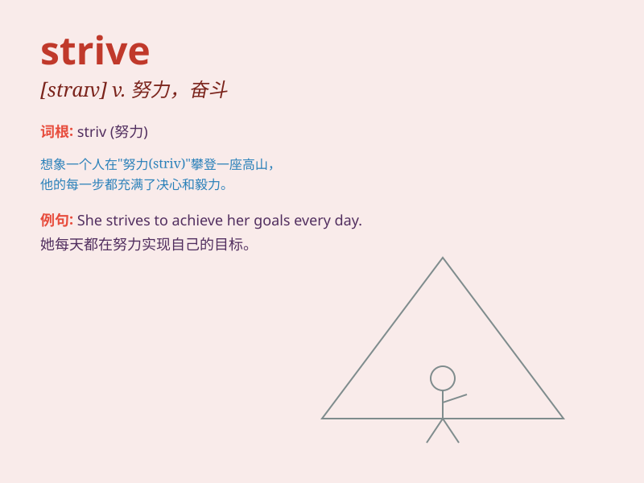

## strive

**英音:** _[straɪv]_ **美音:** _[straɪv]_

**译义:** *v.努力,奋斗,力争,斗争*

### 短语

+ **strive for:** _努力争取；为\...\...而奋斗_

+ **strive against:** _反抗；和\...\...作斗争_

+ **strive to do sth:** _努力做某事_

+ **strive after:** _追求；争取_

+ **strive with:** _与\...\...斗争；与\...\...竞争_

### 例句

#### 例句1

> **We should strive to improve our skills.**

**中文翻译:** 我们应该努力提高我们的技能。

**单词释义:** 努力，奋斗

#### 例句2

> **He is striving for success in his career.**

**中文翻译:** 他正在为事业上的成功而奋斗。

**单词释义:** 努力争取

#### 例句3

> **They strive to create a better environment.**

**中文翻译:** 他们努力创造一个更好的环境。

**单词释义:** 努力做

### 背诵小故事

> 有一只小蚂蚁，它很弱小，但梦想爬上最高的树枝。尽管困难重重，它始终
strive
不停。它努力地攀爬，哪怕一次次跌落，也不放弃。最终，它成功了，因为它的坚持和努力。

**有一只小蚂蚁，它很弱小，但梦想爬上最高的树枝。尽管困难重重，它始终努力奋斗不停。它努力地攀爬，哪怕一次次跌落，也不放弃。最终，它成功了，因为它的坚持和努力。**

### 图义

