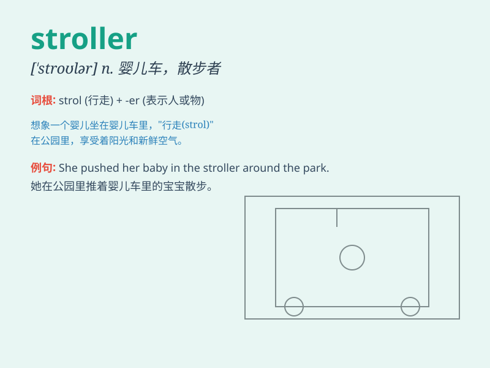

## stroller

**英音:** _[\'strəʊlə]_ **美音:** _[\'strolɚ]_

**译义:** *n.散步者,流浪者*

### 短语

+ **baby stroller:** _婴儿手推车_

+ **street stroller:** _街头漫步者_

+ **park stroller:** _公园散步者_

+ **leisure stroller:** _悠闲的漫步者_

+ **morning stroller:** _清晨散步者_

### 例句

#### 例句1

> **The stroller is easy to maneuver around the park.**

**中文翻译:** 这辆婴儿车在公园里很容易操纵。

**单词释义:** 婴儿车

#### 例句2

> **She pushed the stroller along the busy street.**

**中文翻译:** 她沿着繁忙的街道推着婴儿车。

**单词释义:** 婴儿车

#### 例句3

> **The new stroller has a lot of convenient features.**

**中文翻译:** 这个新的婴儿车有很多方便的功能。

**单词释义:** 婴儿车

### 背诵小故事

> A mother was pushing her baby in a stroller. The stroller had
colorful wheels and a soft cushion. The baby was smiling and enjoying
the ride. The mother walked slowly, making sure her baby was safe and
happy.

**一位母亲正用婴儿车推着她的宝宝。这辆婴儿车有着彩色的轮子和柔软的坐垫。宝宝笑着，享受着这次出行。母亲走得很慢，确保宝宝安全又开心。**

### 图义

