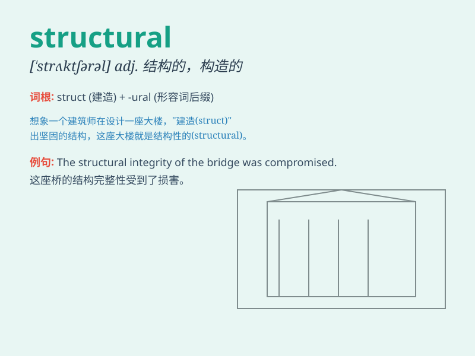

## structural

**英音:** _[\'strʌktʃ(ə)r(ə)l]_ **美音:**
_[\'strʌktʃərəl]_

**译义:** *adj.结构的,建筑的*

### 短语

+ **structural analysis:** _结构分析_

+ **structural engineering:** _结构工程_

+ **structural damage:** _结构损坏_

+ **structural adjustment:** _结构调整_

+ **structural element:** _结构元素_

### 例句

#### 例句1

> **The structural design of the building is very complex.**

**中文翻译:** 这座建筑的结构设计非常复杂。

**单词释义:** 结构的

#### 例句2

> **We need to analyze the structural problems of the economy.**

**中文翻译:** 我们需要分析经济的结构性问题。

**单词释义:** 结构上的

#### 例句3

> **The company is undergoing a structural reorganization.**

**中文翻译:** 公司正在进行结构性重组。

**单词释义:** 结构的

### 背诵小故事

> A builder was working on a structural project. He needed to ensure
the stability of the building by carefully placing each brick. The
structure was like a puzzle, and getting the parts right was crucial.
\'Structural\' means related to the way something is built or organized.

**一位建筑工人正在从事一个结构项目。他需要通过仔细放置每一块砖来确保建筑物的稳定性。这个结构就像一个拼图，把各个部分放对至关重要。\'structural\'意思是与某物的建造或组织方式有关。**

### 图义

