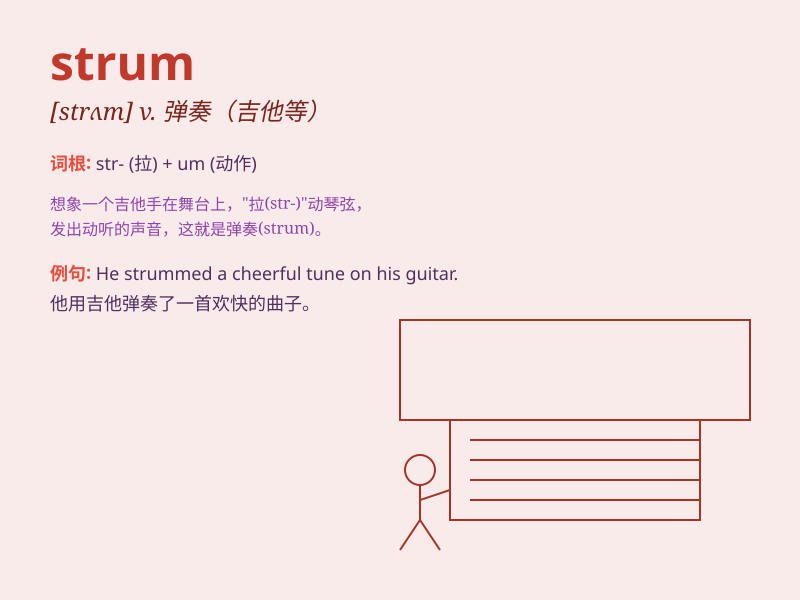

## strum

**英音:** _[strʌm]_ **美音:** _[strʌm]_

**译义:** *n.乱弹的声音v.乱弹,乱奏*

### 短语

+ **strum the guitar:** _弹吉他_

+ **strum casually:** _随意弹奏_

+ **strum a tune:** _弹奏一曲_

+ **strum rhythmically:** _有节奏地弹奏_

+ **strum continuously:** _连续弹奏_

### 例句

#### 例句1

> **He began to strum his guitar gently.**

**中文翻译:** 他开始轻轻地弹拨他的吉他。

**单词释义:** 弹拨（吉他等弦乐器）

#### 例句2

> **She strummed a tune on the ukulele.**

**中文翻译:** 她在尤克里里上弹了一首曲子。

**单词释义:** 弹奏（尤克里里等乐器）

#### 例句3

> **The musician strummed absentmindedly while thinking about the new
composition.**

**中文翻译:** 这位音乐家心不在焉地弹拨着，同时思考着新的作曲。

**单词释义:** 漫不经心地弹拨

### 背诵小故事

>
想象一下，一位流浪歌手在街头，随意地用手指\'strum\'（弹奏）着破旧的吉他，那简单而有节奏的声音吸引了众多路人。他的弹奏并不复杂，却充满了自由和快乐。

**想象一位流浪歌手随意弹奏吉他来辅助记忆 strum
这个单词，意思是弹奏（弦乐器）**

### 图义

