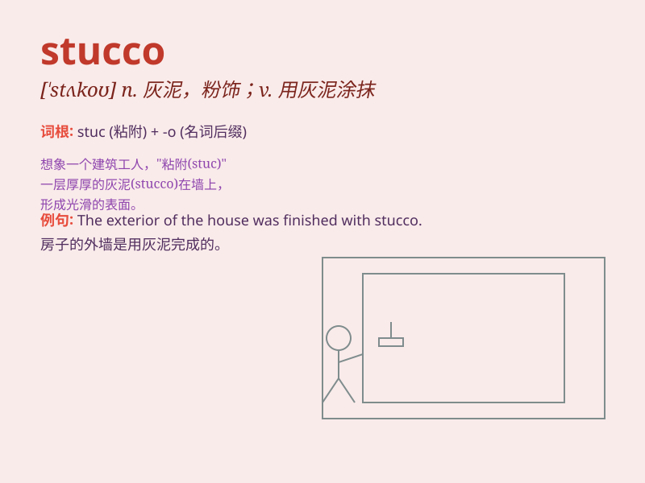

## stucco

**英音:** _[\'stʌkəʊ]_ **美音:** _[\'stʌko]_

**译义:** *n.[建]装饰用的灰泥vt.涂以灰泥,粉刷*

### 短语

+ **stucco work:** _灰泥工程_

+ **stucco wall:** _灰泥墙_

+ **ornamental stucco:** _装饰性灰泥_

+ **stucco finish:** _灰泥饰面_

+ **stucco coating:** _灰泥涂层_

### 例句

#### 例句1

> **The walls of the building were covered with stucco.**

**中文翻译:** 这座建筑的墙壁覆盖着灰泥。

**单词释义:** 灰泥

#### 例句2

> **They used stucco to smooth the surface of the wall.**

**中文翻译:** 他们用灰泥来抹平墙面。

**单词释义:** 灰泥

#### 例句3

> **The old house was decorated with beautiful stucco patterns.**

**中文翻译:** 这座老房子用漂亮的灰泥图案装饰着。

**单词释义:** 灰泥

### 背诵小故事

> One day, a little artist was painting a wall with stucco. It was a
special material that made the wall smooth and beautiful. He worked hard
and finally created a wonderful work.

**有一天，一位小艺术家正在用灰泥粉刷一面墙。这是一种特殊的材料，能让墙面变得光滑又漂亮。他努力工作，最终创作出了一件很棒的作品。**

### 图义

