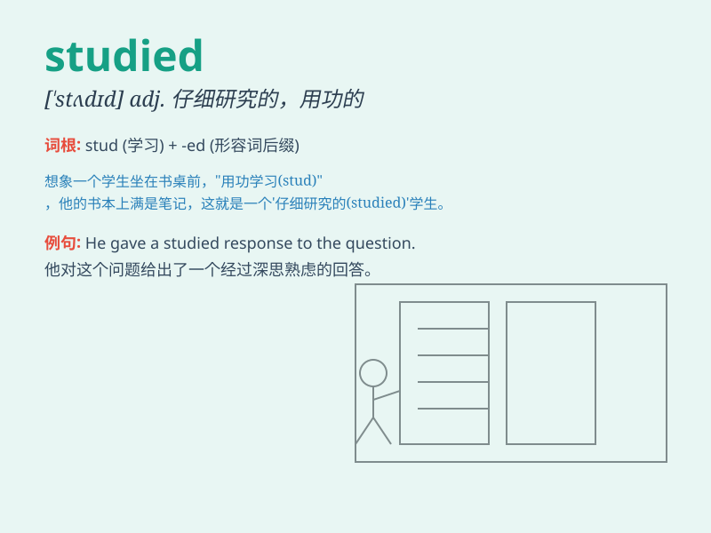

## studied

**英音:** _[\'stʌdɪd]_ **美音:** _[\'stʌdɪd]_

**译义:** *adj.有计划的,故意的*

### 短语

+ **studied hard:** _努力学习_

+ **studied carefully:** _仔细研究_

+ **studied intently:** _专心学习_

+ **studied systematically:** _系统地学习_

+ **studied independently:** _独立学习_

### 例句

#### 例句1

> **He studied hard for the exam.**

**中文翻译:** 他为了考试努力学习。

**单词释义:** 学习

#### 例句2

> **She studied the map carefully before setting off.**

**中文翻译:** 她在出发前仔细研究了地图。

**单词释义:** 研究

#### 例句3

> **They studied the problem from different perspectives.**

**中文翻译:** 他们从不同的角度研究这个问题。

**单词释义:** 研究

### 背诵小故事

> Once upon a time, there was a student who studied very hard every
day. He read books, did exercises, and finally got excellent grades.
Studied here means devoted time and effort to learning.

**从前，有一个学生每天都非常努力地学习。他读书、做练习，最后取得了优异的成绩。这里的studied意味着投入时间和精力去学习。**

### 图义

