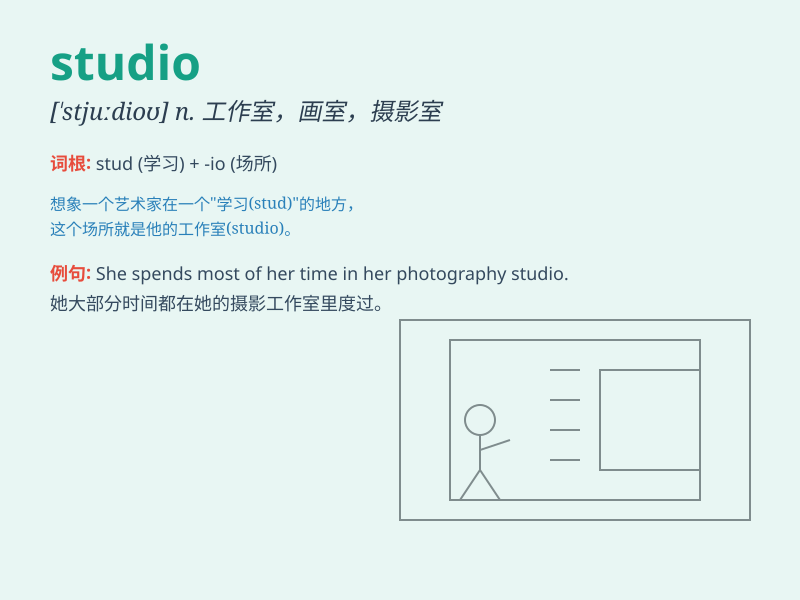

## studio

**英音:** _[\'stjuːdɪəʊ]_ **美音:** _[\'studɪo]_

**译义:**
*n.画室,照相室,工作室,(无线电或电视节目的)演播室,(制作电影的)摄影棚,(电影公司的)摄影场*

### 短语

+ **photo studio:** _照相馆_

+ **film studio:** _电影制片厂_

+ **recording studio:** _录音室_

+ **dance studio:** _舞蹈工作室_

+ **art studio:** _艺术工作室_

### 例句

#### 例句1

> **She works in a dance studio.**

**中文翻译:** 她在一家舞蹈工作室工作。

**单词释义:** 工作室

#### 例句2

> **The artist has his own studio where he creates masterpieces.**

**中文翻译:** 这位艺术家有自己的工作室，在那里他创作杰作。

**单词释义:** 工作室

#### 例句3

> **The TV studio was filled with excitement before the live
broadcast.**

**中文翻译:** 电视演播室在直播前充满了兴奋的气氛。

**单词释义:** 演播室

### 背诵小故事

> A young artist dreams of having a studio of her own. One day, she
finds an empty room and turns it into a beautiful studio with colorful
paints and canvases. Now she can create wonderful artworks there.

**一位年轻的艺术家梦想拥有自己的工作室。有一天，她找到了一个空房间，并用彩色颜料和画布将其变成了一个漂亮的工作室。现在她可以在那里创作精美的艺术品。**

### 图义

