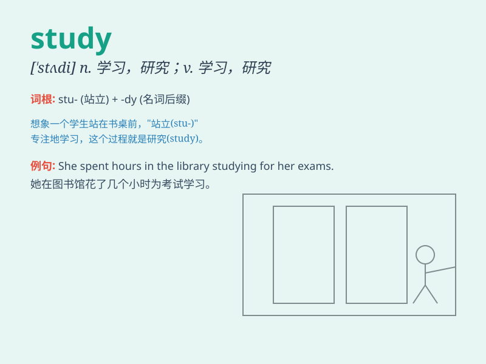

## study

**英音:** _[\'stʌdɪ]_ **美音:** _[\'stʌdi]_

**译义:**
*n.学习,研究,学科,试作,论文,求学,努力,书房vt.学习,攻读,研究,考虑,计划vi.学习,试图*

### 短语

+ **study hard:** _努力学习_

+ **case study:** _案例研究_

+ **study room:** _书房_

+ **make a study:** _进行研究_

+ **further study:** _进一步研究；深造_

### 例句

#### 例句1

> **I need to study for my exam tomorrow.**

**中文翻译:** 我需要为明天的考试学习。

**单词释义:** 学习

#### 例句2

> **She is studying medicine at university.**

**中文翻译:** 她在大学里学医。

**单词释义:** 攻读；研究

#### 例句3

> **The scientist is studying the behavior of bees.**

**中文翻译:** 这位科学家正在研究蜜蜂的行为。

**单词释义:** 研究；调查

### 背诵小故事

> One day, Tom was very worried because he had a big exam coming up. To
pass it, he spent every night in his room, sitting at the desk and
STUDYING hard. Finally, his efforts paid off and he got a great score.

**有一天，汤姆非常担心，因为他有一场重要的考试即将来临。为了通过考试，他每晚都在房间里坐在书桌前努力学习。最后，他的努力得到了回报，他取得了好成绩。**

### 图义

