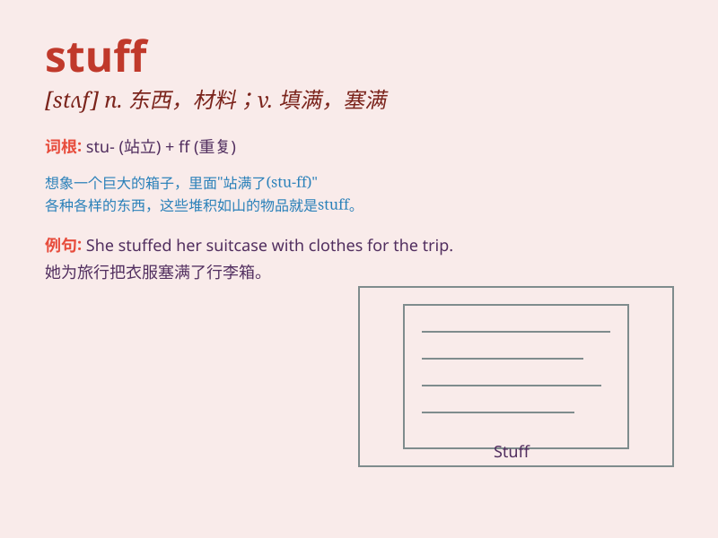

## stuff

**英音:** _[stʌf]_ **美音:** _[stʌf]_

**译义:** *n.原料,材料,素材资料vt.塞满,填满,填充*

### 短语

+ **stuff up:** _堵塞；填满_

+ **stuff with:** _用......把......塞满_

+ **hot stuff:** _奇才；非凡的事物；性感的人_

+ **strange stuff:** _奇怪的东西_

+ **good stuff:** _好东西；好材料_

### 例句

#### 例句1

> **I need to stuff these clothes into the suitcase.**

**中文翻译:** 我需要把这些衣服塞进手提箱里。

**单词释义:** 塞满；填满

#### 例句2

> **This room is stuffed with old furniture.**

**中文翻译:** 这个房间堆满了旧家具。

**单词释义:** 装满；充斥

#### 例句3

> **He stuffed himself with pizza.**

**中文翻译:** 他狼吞虎咽地吃披萨。

**单词释义:** （使）吃饱

### 背诵小故事

>
想象一下，有个魔法盒子，里面装满了各种神奇的东西，有闪闪发光的宝石，柔软的羽毛，还有古老的地图。我们把这个盒子里所有的东西统称为
stuff。

**想象有个魔法盒子装满各种物品，这些物品统称为 stuff。**

### 图义

