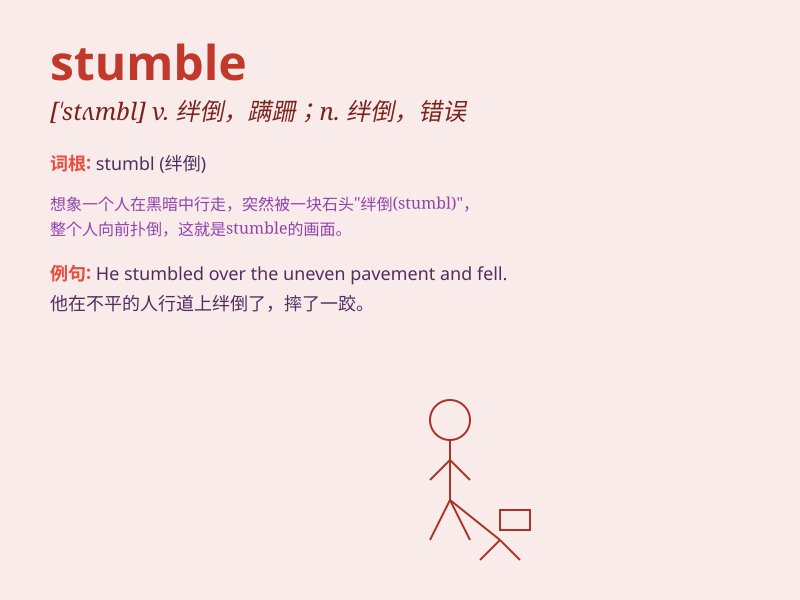

## stumble

**英音:** _[\'stʌmb(ə)l]_ **美音:** _[\'stʌmbl]_

**译义:** *v.绊倒,使困惑,蹒跚,结结巴巴地说话,踌躇n.绊倒,错误*

### 短语

+ **stumble across:** _偶然遇到；无意中发现_

+ **stumble upon:** _意外发现；偶然遇见_

+ **stumble along:** _蹒跚而行；跌跌撞撞地走_

+ **stumble into:** _无意中卷入；陷入_

+ **stumble out:** _跌跌撞撞地走出来_

### 例句

#### 例句1

> **I stumbled over a rock and fell.**

**中文翻译:** 我被一块石头绊倒了并摔倒了。

**单词释义:** 绊倒

#### 例句2

> **He stumbled through his speech because he was nervous.**

**中文翻译:** 他因为紧张说话结结巴巴。

**单词释义:** 结结巴巴地说

#### 例句3

> **The drunk man stumbled along the street.**

**中文翻译:** 那个醉汉在街上跌跌撞撞地走着。

**单词释义:** 跌跌撞撞地走

### 背诵小故事

> One night, a man was walking in the dark and suddenly stumbled over a
stone. He almost fell down but managed to catch himself. The experience
made him remember the word \'stumble\', which means to trip or walk
unsteadily.

**一天晚上，一个男人在黑暗中行走，突然被一块石头绊了一下。他差点摔倒，但设法稳住了自己。这次经历让他记住了"stumble"这个词，意思是绊倒或步履蹒跚。**

### 图义

