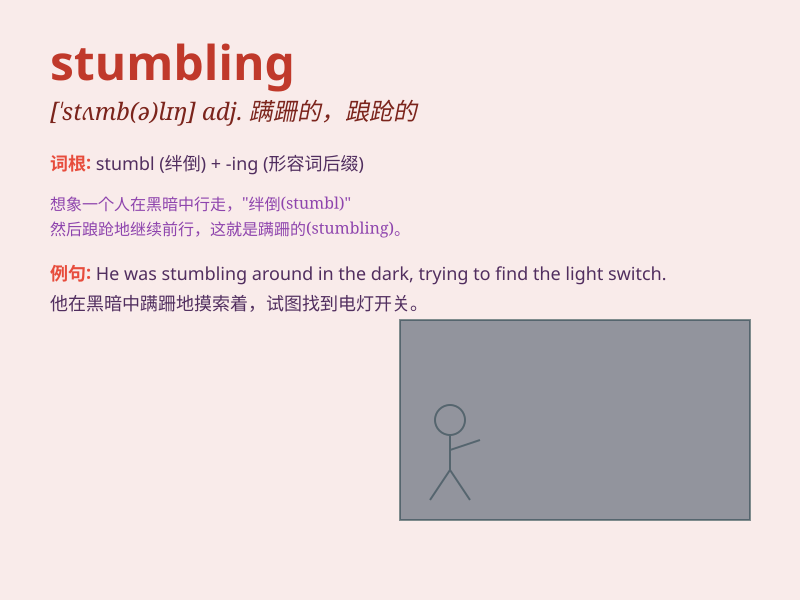

## stumbling

**英音:** _[ˈstʌmblɪŋ]_ **美音:** _[ˈstʌmblɪŋ]_

**译义:**
*adj.结结巴巴的；踉踉跄跄的；n.跌跌撞撞；v.绊倒（stumble的ing形式）*

### 短语

+ **stumbling block:** _障碍物；绊脚石_

+ **stumbling gait:** _蹒跚的步态_

+ **stumbling speech:** _结结巴巴的讲话_

+ **stumbling attempt:** _笨拙的尝试_

+ **stumbling progress:** _跌跌撞撞的进展_

### 例句

#### 例句1

> **He was stumbling along the uneven path.**

**中文翻译:** 他在不平坦的小路上蹒跚而行。

**单词释义:** 蹒跚；磕磕绊绊地走

#### 例句2

> **The economy is still stumbling towards recovery.**

**中文翻译:** 经济仍在艰难地走向复苏。

**单词释义:** 艰难地行进；跌跌撞撞

#### 例句3

> **She kept stumbling over her words during the speech.**

**中文翻译:** 她在演讲中不断结巴，说错话。

**单词释义:** 结巴；说话结结巴巴

### 背诵小故事

> A clumsy bear was stumbling in the forest. It kept tripping over
roots and rocks because it was too sleepy. But it didn\'t give up and
finally found its way home. The word \'stumbling\' means to walk
unsteadily and nearly fall.

**一只笨拙的熊在森林里蹒跚而行。它因为太困了，老是被树根和石头绊倒。但它没有放弃，最终找到了回家的路。单词'stumbling'意思是摇摇晃晃地走，几乎跌倒。**

### 图义

