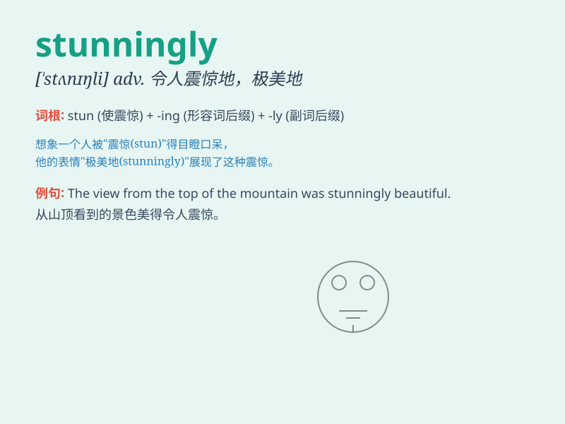

## stunningly

**英音:** _[ˈstʌnɪŋli]_ **美音:** _[ˈstʌnɪŋli]_

**译义:** *adv. 惊人地；令人震惊地；极其*

### 短语

+ **stunningly beautiful:** _极其美丽_

+ **stunningly successful:** _极其成功_

+ **stunningly intelligent:** _极其聪明_

+ **stunningly creative:** _极其有创造力_

+ **stunningly brave:** _极其勇敢_

### 例句

#### 例句1

> **The view from the top of the mountain was stunningly
beautiful.**

**中文翻译:** 从山顶看到的景色美得惊人。

**单词释义:** 惊人地；令人震惊地

#### 例句2

> **She was stunningly dressed for the party.**

**中文翻译:** 她为聚会穿得极为漂亮。

**单词释义:** 极其；非常

#### 例句3

> **The athlete performed stunningly well in the competition.**

**中文翻译:** 这位运动员在比赛中表现得极为出色。

**单词释义:** 极其；非常

### 背诵小故事

> A young artist was painting a landscape. When she finished, everyone
was stunned. The colors and details were stunningly beautiful. People
couldn\'t believe how amazing it was.

**一位年轻的艺术家正在画一幅风景画。当她完成时，每个人都惊呆了。颜色和细节美得令人惊叹。人们简直不敢相信它有多么惊人。**

### 图义

