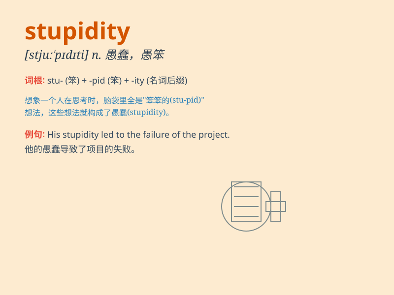

## stupidity

**英音:** _[stʃʊ\'pɪdɪtɪ; stʃuː\'pɪdɪtɪ; stjʊ\'pɪdɪtɪ;
stjuː\'pɪdɪtɪ]_ **美音:** _[stu\'pɪdəti]_

**译义:** *n.愚蠢,糊涂事*

### 短语

+ **act of stupidity:** _愚蠢的行为_

+ **sheer stupidity:** _十足的愚蠢_

+ **unbelievable stupidity:** _难以置信的愚蠢_

+ **display stupidity:** _表现出愚蠢_

+ **fall into stupidity:** _陷入愚蠢_

### 例句

#### 例句1

> **His stupidity cost him the job.**

**中文翻译:** 他的愚蠢使他丢了工作。

**单词释义:** 愚蠢；愚笨

#### 例句2

> **I can\'t believe the stupidity of her decision.**

**中文翻译:** 我真不敢相信她的决定如此愚蠢。

**单词释义:** 愚蠢；愚昧

#### 例句3

> **The stupidity of the plan was obvious to everyone.**

**中文翻译:** 这个计划的愚蠢之处对每个人来说都很明显。

**单词释义:** 愚蠢；糊涂

### 背诵小故事

> One day, a man showed great stupidity by trying to catch a falling
star. He climbed a tall tree and jumped, thinking he could hold it. But
of course, he just hurt himself. This shows the meaning of stupidity -
doing very foolish things.

**有一天，一个男人表现出极大的愚蠢，他试图抓住一颗坠落的星星。他爬上一棵高大的树然后跳起来，以为自己能抓住它。但当然，他只是伤到了自己。这体现了'stupidity'愚蠢的含义------做非常愚蠢的事。**

### 图义

