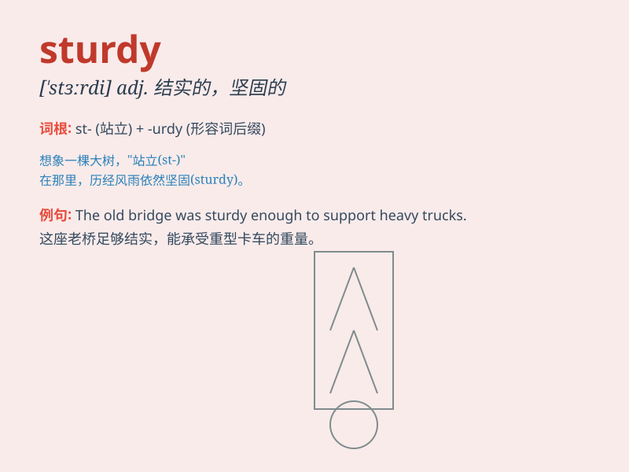

## sturdy

**英音:** _[\'stɜːdɪ]_ **美音:** _[\'stɝdi]_

**译义:** *adj.强健的,坚定的,毫不含糊的n.[兽医]家畜晕倒病*

### 短语

+ **sturdy structure:** _坚固的结构_

+ **sturdy shoes:** _结实的鞋子_

+ **sturdy frame:** _坚固的框架_

+ **sturdy defense:** _坚固的防御_

+ **sturdy build:** _强壮的体格_

### 例句

#### 例句1

> **The sturdy chair can hold up to 200 pounds.**

**中文翻译:** 这把坚固的椅子能承受多达 200 磅的重量。

**单词释义:** 坚固的

#### 例句2

> **He has a sturdy build and is very strong.**

**中文翻译:** 他体格健壮，非常强壮。

**单词释义:** 健壮的

#### 例句3

> **The sturdy walls of the castle have withstood many attacks.**

**中文翻译:** 城堡坚固的城墙抵御了许多次攻击。

**单词释义:** 坚固的

### 背诵小故事

> A brave knight was riding through a storm. His horse was sturdy and
didn\'t fear the strong wind. It carried the knight safely, showing its
strength and stability. The knight praised the sturdy horse for its
reliability.

**一位勇敢的骑士在暴风雨中骑行。他的马很结实，不惧怕强风。它稳稳地驮着骑士，展现出力量和稳定性。骑士称赞这匹结实可靠的马。**

### 图义

