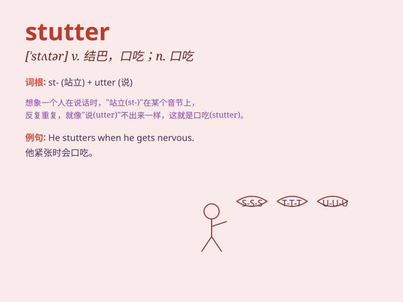

## stutter

**英音:** _[\'stʌtə]_ **美音:** _[\'stʌtɚ]_

**译义:** *n.口吃,结结巴巴v.口吃着说*

### 短语

+ **stutter out:** _结结巴巴地说出_

+ **stutter over:** _在\...上口吃_

+ **chronic stutter:** _慢性口吃_

+ **nervous stutter:** _紧张性口吃_

+ **overcome stutter:** _克服口吃_

### 例句

#### 例句1

> **He tends to stutter when he\'s nervous.**

**中文翻译:** 他紧张时往往会口吃。

**单词释义:** 口吃；结结巴巴地说

#### 例句2

> **The engine of the old car started to stutter.**

**中文翻译:** 那辆旧车的引擎开始断断续续地运转。

**单词释义:** （机器）运转不顺畅；突突地响

#### 例句3

> **Her steps stuttered as she walked on the slippery road.**

**中文翻译:** 她走在滑路上，脚步踉跄。

**单词释义:** 踉跄；停顿

### 背诵小故事

> 小明平时说话很流利，但一到重要场合就会 stutter
结巴。有次演讲，他因为紧张，stutter
个不停，台下的人都为他着急。后来他不断练习，终于克服了这个问题。

**小明平时说话流利，但在重要场合会结巴。一次演讲因紧张结巴不停，后来通过练习克服了。**

### 图义

