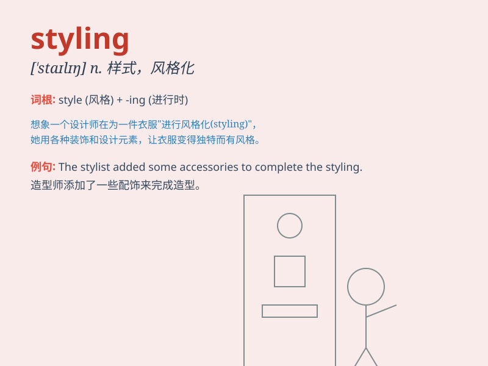

## styling

**英音:** _[ˈstaɪlɪŋ]_ **美音:** _[ˈstaɪlɪŋ]_

**译义:** *n. 造型；设计；风格化；样式 vt.
使具有某种风格（style的现在分词）*

### 短语

+ **hairstyling:** _发型设计_

+ **fashion styling:** _时尚造型_

+ **interior styling:** _室内设计风格_

+ **product styling:** _产品造型_

+ **graphic styling:** _图形设计风格_

### 例句

#### 例句1

> **The car\'s styling is very modern and sleek.**

**中文翻译:** 这辆车的造型非常现代和时尚。

**单词释义:** 造型；款式

#### 例句2

> **She is responsible for the styling of the fashion show.**

**中文翻译:** 她负责时装秀的造型设计。

**单词释义:** 造型设计

#### 例句3

> **The new building\'s styling combines traditional and contemporary
elements.**

**中文翻译:** 新建筑的风格融合了传统和现代元素。

**单词释义:** 风格

### 背诵小故事

> A fashion designer was struggling with the styling of a new dress.
She tried many combinations but couldn\'t get it right. Finally, she had
a brilliant idea and created a stunning styling that everyone loved.

**一位时装设计师在为一件新裙子的款式设计而苦苦挣扎。她尝试了许多组合但都不对。最后，她有了一个绝妙的主意，创造出了一个令人惊艳的款式，每个人都喜欢。**

### 图义

