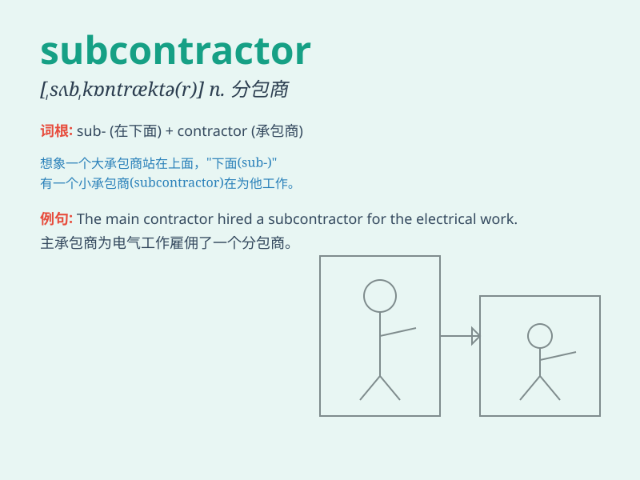

## subcontractor

**英音:** _[sʌbkən\'træktə(r)]_ **美音:**
_[sʌb\'kɑntræktɚ]_

**译义:** *n.转包商,次承包者*

### 短语

+ **prime subcontractor:** _主要分包商_

+ **qualified subcontractor:** _合格的分包商_

+ **local subcontractor:** _当地的分包商_

+ **international subcontractor:** _国际分包商_

+ **reliable subcontractor:** _可靠的分包商_

### 例句

#### 例句1

> **The main contractor hired several subcontractors to handle
different aspects of the project.**

**中文翻译:** 总承包商雇佣了几个分包商来处理项目的不同方面。

**单词释义:** 分包商

#### 例句2

> **The subcontractor was responsible for the electrical work on the
construction site.**

**中文翻译:** 这个分包商负责建筑工地上的电气工作。

**单词释义:** 分包商

#### 例句3

> **We need to check the qualifications of the subcontractor before
awarding the contract.**

**中文翻译:** 在授予合同之前，我们需要检查分包商的资质。

**单词释义:** 分包商

### 背诵小故事

> 想象一个大建筑项目，总承包商忙不过来，于是找了个帮手，这个帮手就是
subcontractor。总承包商把一部分工作分包给了他，subcontractor
就负责完成这部分特定的任务。

**想象一个大建筑项目中，总承包商因忙碌而找来负责部分特定任务的分包商的情景。**

### 图义

