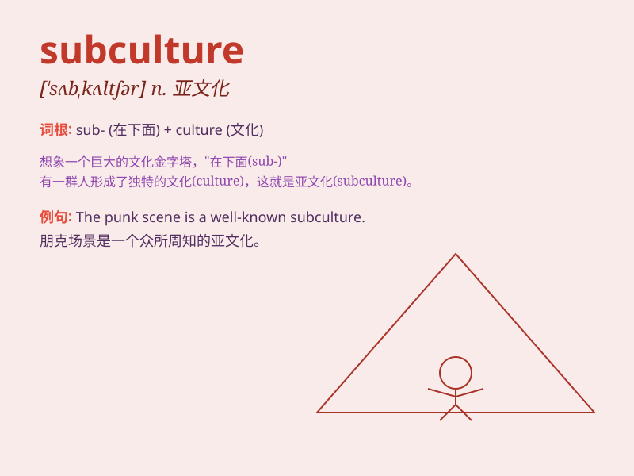

## subculture

**英音:** _[\'sʌbkʌltʃə]_ **美音:** _[\'sʌbkʌltʃɚ]_

**译义:** *n.次培养基,次培养菌v.次培养*

### 短语

+ **youth subculture:** _青年亚文化_

+ **pop subculture:** _流行亚文化_

+ **alternative subculture:** _另类亚文化_

+ **urban subculture:** _城市亚文化_

+ **music subculture:** _音乐亚文化_

### 例句

#### 例句1

> **The punk subculture emerged in the 1970s and was known for its
rebellious style.**

**中文翻译:** 朋克亚文化在 20 世纪 70
年代出现，以其叛逆的风格而闻名。

**单词释义:** 亚文化

#### 例句2

> **The online gaming subculture has its own unique language and
norms.**

**中文翻译:** 在线游戏亚文化有其独特的语言和规范。

**单词释义:** 亚文化

#### 例句3

> **She was deeply involved in the hip-hop subculture and loved its
music and dance.**

**中文翻译:** 她深深地涉足于嘻哈亚文化，并喜爱其音乐和舞蹈。

**单词释义:** 亚文化

### 背诵小故事

> In a big city, there was a group of young people who loved a special
kind of music and had unique fashion. They formed a subculture. They
were different from the mainstream but had their own charm and fun.

**在一个大城市里，有一群年轻人热爱一种特别的音乐，有着独特的时尚风格。他们形成了一种亚文化。他们与主流不同，但有着自己的魅力和乐趣。**

### 图义

