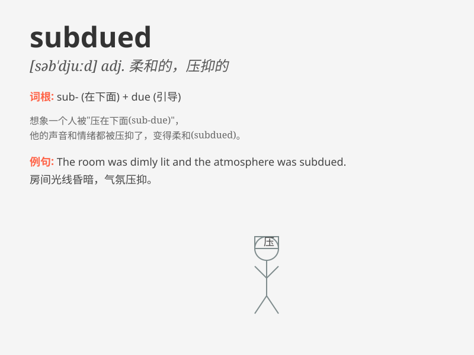

## subdued

**英音:** _[səb\'djuːd]_ **美音:** _[səb\'dud]_

**译义:** *adj.屈服的,被抑制的,柔和的,减弱的*

### 短语

+ **subdued lighting:** _柔和的灯光_

+ **subdued mood:** _压抑的心情_

+ **subdued color:** _柔和的颜色_

+ **subdued voice:** _低沉的声音_

+ **subdued excitement:** _压抑的兴奋_

### 例句

#### 例句1

> **The lighting in the room was subdued, creating a relaxing
atmosphere.**

**中文翻译:** 房间里的灯光很柔和，营造出一种放松的氛围。

**单词释义:** 柔和的；昏暗的

#### 例句2

> **After the argument, his mood was subdued.**

**中文翻译:** 争论过后，他的情绪低落。

**单词释义:** 压抑的；消沉的

#### 例句3

> **The colors of the painting were subdued and harmonious.**

**中文翻译:** 这幅画的色彩柔和协调。

**单词释义:** 柔和的；不鲜艳的

### 背诵小故事

> A brave knight entered a dark cave. The monsters inside were subdued
by his powerful magic. They became quiet and obedient. The knight\'s
victory showed the meaning of \'subdued\' - made quiet, controlled or
overcome.

**一位勇敢的骑士进入一个黑暗的洞穴。里面的怪物被他强大的魔法制服了。它们变得安静且顺从。骑士的胜利展现了'subdued'的意思 -
使安静、被控制或被制服。**

### 图义

