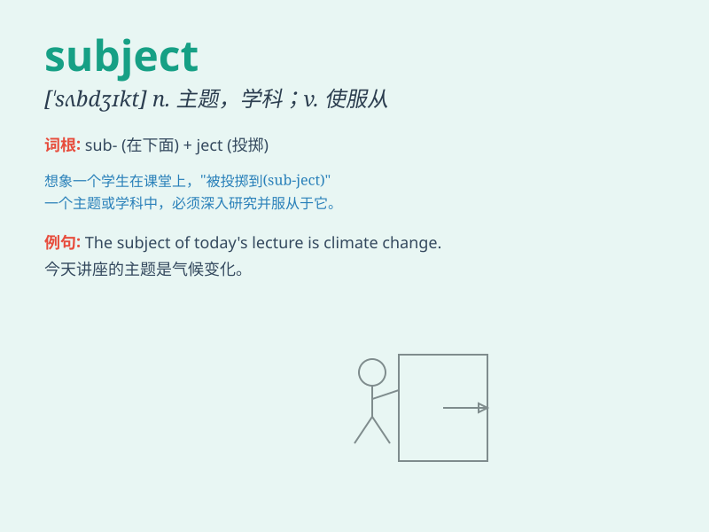

## subject

**英音:** _[ˈsʌbdʒɪkt;(for adj.)ˈsʌbdʒɪkt;(for v.)səbˈdʒekt]_
**美音:** _[ˈsʌbdʒɪkt;(for adj.)ˈsʌbdʒɪkt;(for v.)səbˈdʒɛkt]_

**译义:**
*n.题目,主题,科目,学科,国民,[语法]主语adj.受他国统治的,未独立的,受制于\...的,受\...影响的,以\...为条件的vt.使屈从于\...,使隶属*

### 短语

+ **subject matter:** _主题；论题；题材_

+ **subject to:** _使服从；使遭受；受...支配_

+ **on the subject of:** _谈到...时；关于..._

+ **major subject:** _主修科目_

+ **subject area:** _主题范围；学科领域_

### 例句

#### 例句1

> **The subject of the meeting is very important.**

**中文翻译:** 这次会议的主题非常重要。

**单词释义:** 主题；话题

#### 例句2

> **She is a subject of the Queen.**

**中文翻译:** 她是女王的臣民。

**单词释义:** 臣民；国民

#### 例句3

> **Biology is my favorite subject.**

**中文翻译:** 生物是我最喜欢的学科。

**单词释义:** 学科；科目

### 背诵小故事

>
想象一个国王在朝堂上，大臣们向他汇报各种事务，这些事务就是'subject'。国王是主体，事务是他要处理的对象。就像我们在学校，学习的科目也是'subject'，是我们要钻研的对象。

**想象一位国王和大臣们的场景来辅助理解'subject'这个单词，它有'主题；科目；对象'等意思**

### 图义

