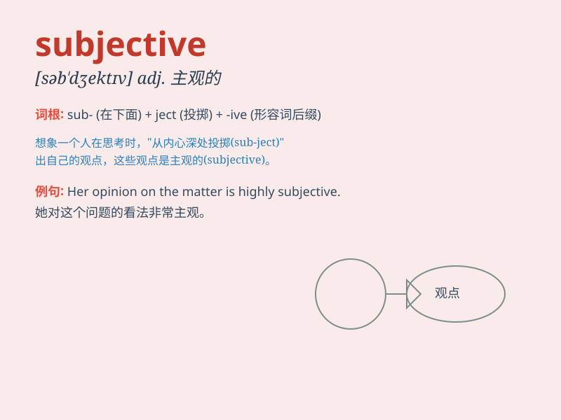

## subjective

**英音:** _[səb\'dʒektɪv]_ **美音:** _[səb\'dʒɛktɪv]_

**译义:** *adj.主观的,个人的*

### 短语

+ **subjective opinion:** _主观意见_

+ **subjective experience:** _主观体验_

+ **subjective judgment:** _主观判断_

+ **subjective factor:** _主观因素_

+ **subjective consciousness:** _主观意识_

### 例句

#### 例句1

> **The evaluation of art is often subjective.**

**中文翻译:** 艺术的评价往往是主观的。

**单词释义:** 主观的

#### 例句2

> **His opinion on the matter was highly subjective.**

**中文翻译:** 他对这件事的看法非常主观。

**单词释义:** 主观的

#### 例句3

> **Subjective factors can influence our decision-making.**

**中文翻译:** 主观因素会影响我们的决策。

**单词释义:** 主观的

### 背诵小故事

>
想象一下，画家在创作时，完全凭借自己内心的感受和想法，这种基于个人内心的判断就是\'subjective\'。就像他画天空的颜色，不依据客观事实，全由主观决定。

**想象画家创作时凭借个人内心感受和想法来决定画面，以此解释主观的意思**

### 图义

