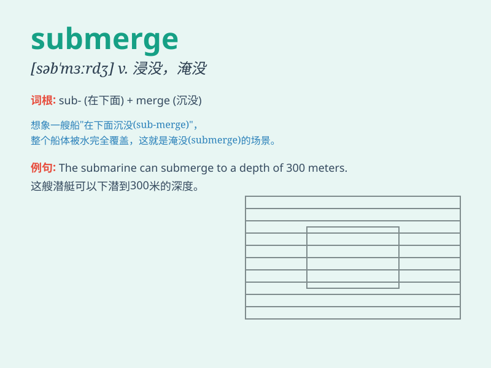

## submerge

**英音:** _[səb\'mɜːdʒ]_ **美音:** _[səb\'mɝdʒ]_

**译义:** *v.浸没,淹没,掩没vi.潜水*

### 短语

+ **submerge completely:** _完全浸没_

+ **submerge oneself in:** _专心于；沉浸于_

+ **submerge gradually:** _逐渐淹没_

+ **submerge temporarily:** _暂时浸没_

+ **submerge underwater:** _淹没在水下_

### 例句

#### 例句1

> **The submarine submerged to avoid detection.**

**中文翻译:** 潜艇潜入水下以避免被发现。

**单词释义:** 潜入水中

#### 例句2

> **The flood submerged the entire village.**

**中文翻译:** 洪水淹没了整个村庄。

**单词释义:** 淹没

#### 例句3

> **He submerged himself in work to forget his troubles.**

**中文翻译:** 他埋头工作以忘却烦恼。

**单词释义:** 使沉浸

### 背诵小故事

> A brave diver decided to submerge into the deep ocean. He wore his
gear, took a deep breath, and let himself go under the water. Soon, he
was completely surrounded by the blue, as if vanishing into another
world.

**一位勇敢的潜水员决定潜入深海。他穿戴好装备，深吸一口气，让自己沉入水中。很快，他就完全被蓝色包围，仿佛消失在另一个世界里。**

### 图义

