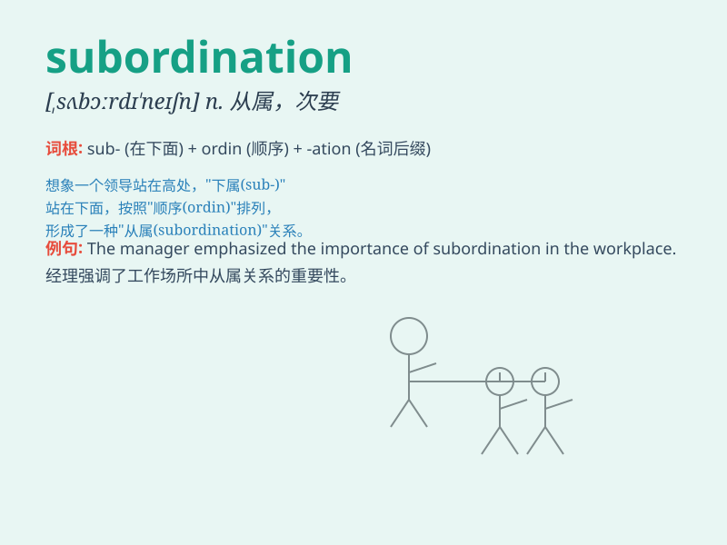

## subordination

**英音:** _[sə,bɔːdɪ\'neɪʃn]_ **美音:**
_[səb,ɔrdn\'eʃən]_

**译义:** *n.部属,部下,次要*

### 短语

+ **subordination clause:** _从属条款_

+ **subordination of interests:** _利益从属_

+ **subordination agreement:** _从属协议_

+ **degree of subordination:** _从属程度_

+ **subordination relationship:** _从属关系_

### 例句

#### 例句1

> **The subordination of the minor departments to the main office was
clearly defined.**

**中文翻译:** 较小部门对主要办公室的从属关系被明确界定。

**单词释义:** 从属，隶属

#### 例句2

> **In this company, there is a strict hierarchy of
subordination.**

**中文翻译:** 在这家公司，存在严格的从属等级制度。

**单词释义:** 从属关系

#### 例句3

> **The subordination of personal interests to the collective ones is
highly valued.**

**中文翻译:** 个人利益从属于集体利益是被高度重视的。

**单词释义:** 从属于

### 背诵小故事

> A young employee was constantly facing subordination at work. He had
to follow every order from his boss, feeling frustrated. But later, he
learned to use it as a motivation to climb the career ladder.

**一位年轻的员工在工作中一直处于从属地位。他不得不听从老板的每一个命令，感到沮丧。但后来，他学会将其作为攀登职业阶梯的动力。**

### 图义

