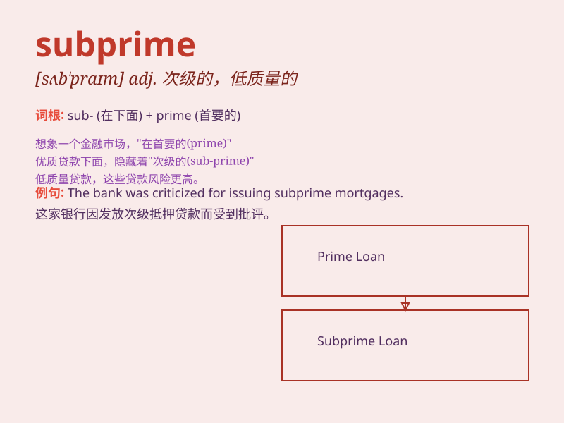

## subprime

**英音:** _[sʌb\'praɪm]_ **美音:** _[sʌb\'praɪm]_

**译义:**
*adj.次级的；次优的；次级信用的（指贷款或借款人的信用低于优质信用）*

### 短语

+ **subprime mortgage:** _次级抵押贷款_

+ **subprime crisis:** _次贷危机_

+ **subprime borrower:** _次级借款人_

+ **subprime lending:** _次级贷款_

+ **subprime market:** _次级市场_

### 例句

#### 例句1

> **The subprime mortgage crisis had a significant impact on the
global economy.**

**中文翻译:** 次贷危机对全球经济产生了重大影响。

**单词释义:**
次级的；低于标准的（在这个句子中指低于优质标准的抵押贷款）

#### 例句2

> **Many people were affected by subprime loans and lost their
homes.**

**中文翻译:** 许多人受到次级贷款的影响并失去了他们的房屋。

**单词释义:** 次级的（这里指质量较差的贷款）

#### 例句3

> **The bank was cautious about offering subprime credit cards.**

**中文翻译:** 这家银行对提供次级信用卡很谨慎。

**单词释义:** 次级的（此处指信用评级较低的信用卡）

### 背诵小故事

> 想象一个小镇，银行给那些信用不太好的人发放贷款，这些贷款就被称为
subprime 贷款。后来很多人还不上钱，引发了经济危机。所以 subprime
就是指低于标准的、次优级的。

**想象一个关于次优级贷款的故事来辅助记忆 subprime
这个单词，意思是低于标准的、次优级的**

### 图义

