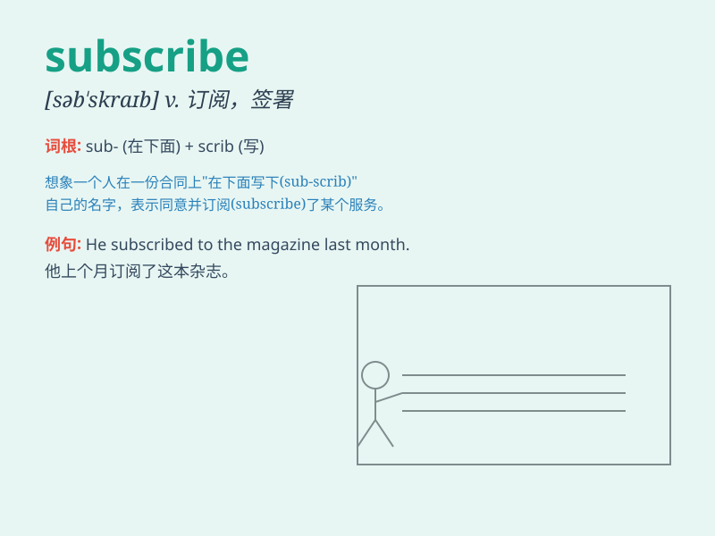

## subscribe

**英音:** _[səb\'skraɪb]_ **美音:** _[səb\'skraɪb]_

**译义:** *v.捐款,订阅,签署(文件),赞成,预订*

### 短语

+ **subscribe to:** _订阅；同意；捐款_

+ **subscribe for:** _认购；预订_

+ **subscribe now:** _立即订阅_

+ **subscribe online:** _在线订阅_

+ **subscribe annually:** _每年订阅_

### 例句

#### 例句1

> **I subscribe to several magazines to keep myself informed.**

**中文翻译:** 我订阅了几本杂志来让自己了解信息。

**单词释义:** 订阅

#### 例句2

> **He decided to subscribe to the charity to help those in need.**

**中文翻译:** 他决定向慈善机构捐款以帮助那些有需要的人。

**单词释义:** 捐款；资助

#### 例句3

> **You should subscribe to the idea that hard work leads to
success.**

**中文翻译:** 你应该认同努力工作通向成功这一观点。

**单词释义:** 同意；赞成

### 背诵小故事

> A poor student wanted to learn knowledge but had no money. Then he
found a website that allowed him to subscribe for free. He was so happy
and finally got what he needed.

**一个贫困的学生想要学习知识但没有钱。然后他发现了一个可以免费订阅的网站。他非常高兴，最终得到了他需要的。**

### 图义

