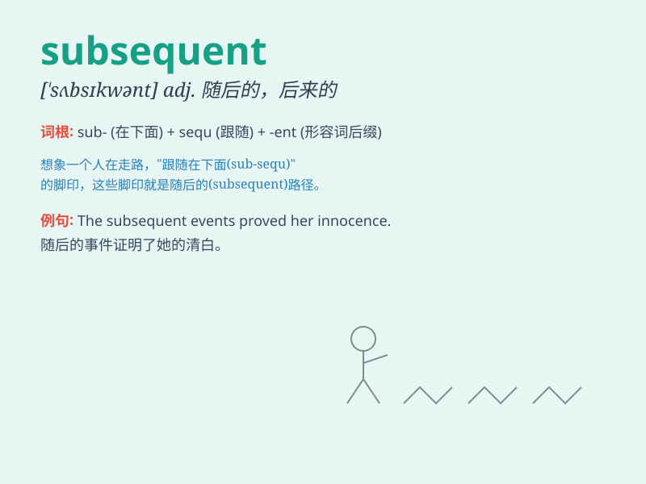

## subsequent

**英音:** _[\'sʌbsɪkw(ə)nt]_ **美音:** _[\'sʌbsɪkwənt]_

**译义:** *adj.后来的,并发的*

### 短语

+ **subsequent events:** _后续事件_

+ **subsequent development:** _后续发展_

+ **subsequent period:** _随后时期_

+ **subsequent to:** _在\...之后_

+ **subsequent generations:** _后代_

### 例句

#### 例句1

> **The subsequent chapters of the book are even more
interesting.**

**中文翻译:** 这本书的后续章节甚至更有趣。

**单词释义:** 随后的；后来的

#### 例句2

> **Subsequent events proved me wrong.**

**中文翻译:** 后来发生的事证明我错了。

**单词释义:** 后来的

#### 例句3

> **There was a decline in sales in the subsequent months.**

**中文翻译:** 在随后的几个月里销售额有所下降。

**单词释义:** 随后的

### 背诵小故事

> A brave adventurer found a hidden cave. The first treasure he
discovered was amazing. But the subsequent treasures were even more
astonishing. They were beyond his wildest dreams.

**一位勇敢的冒险家发现了一个隐藏的洞穴。他发现的第一件宝藏令人惊叹。但随后的宝藏更是惊人。它们超出了他最疯狂的梦想。**

### 图义

