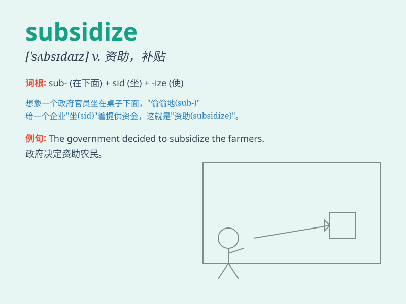

## subsidize

**英音:** _[ˈsʌbsɪdaɪz]_ **美音:** _[\'sʌbsə\'daɪz]_

**译义:** *v.资助,津贴*

### 短语

+ **subsidize agriculture:** _补贴农业_

+ **subsidize housing:** _补贴住房_

+ **subsidize education:** _补贴教育_

+ **subsidize industry:** _补贴工业_

+ **subsidize public transportation:** _补贴公共交通_

### 例句

#### 例句1

> **The government subsidizes farmers to encourage agricultural
production.**

**中文翻译:** 政府补贴农民以鼓励农业生产。

**单词释义:** 资助；补助；给...发津贴

#### 例句2

> **The company is subsidized by a large investment firm.**

**中文翻译:** 这家公司由一家大型投资公司提供资助。

**单词释义:** 资助；补助；给...发津贴

#### 例句3

> **Some countries subsidize public transportation to make it more
accessible.**

**中文翻译:** 一些国家对公共交通进行补贴，使其更易于使用。

**单词释义:** 资助；补助；给...发津贴

### 背诵小故事

> A poor farmer was struggling to grow crops. Luckily, the government
subsidized him with money and resources. This support helped him buy
better seeds and tools, and eventually he had a great harvest.

**一个贫穷的农民在种植庄稼时举步维艰。幸运的是，政府给他提供了资金和资源的补贴。这种支持帮助他购买了更好的种子和工具，最终他获得了大丰收。**

### 图义

