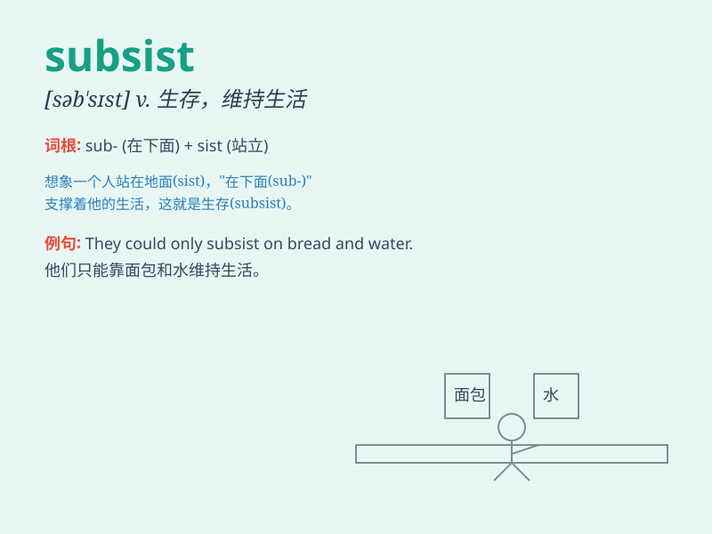

## subsist

**英音:** _[səb\'sɪst]_ **美音:** _[səb\'sɪst]_

**译义:** *v.生存,存在,供养*

### 短语

+ **subsist on:** _靠\...\...生存；以\...\...为生_

+ **subsist in:** _存在于\...\...中；在\...\...中维持生活_

+ **barely subsist:** _勉强维持生计_

+ **subsist by doing sth:** _通过做某事维持生活_

+ **difficult to subsist:** _难以生存_

### 例句

#### 例句1

> **In the wild, some animals subsist on very little food.**

**中文翻译:** 在野外，有些动物靠很少的食物生存。

**单词释义:** 生存；维持生活

#### 例句2

> **The poor family subsists mainly on welfare payments.**

**中文翻译:** 这个贫困家庭主要靠福利金维持生计。

**单词释义:** 维持生计

#### 例句3

> **They managed to subsist in the desert for several days without
water.**

**中文翻译:** 他们设法在没有水的沙漠中生存了几天。

**单词释义:** 生存

### 背诵小故事

> A poor man had to subsist on very little food. He struggled every day
but managed to survive. Subsist means to stay alive, especially with the
minimum resources needed.

**一个穷人只能靠极少的食物维持生计。他每天都很艰难，但还是设法活了下来。subsist
意思是生存，尤指依靠最少的资源。**

### 图义

