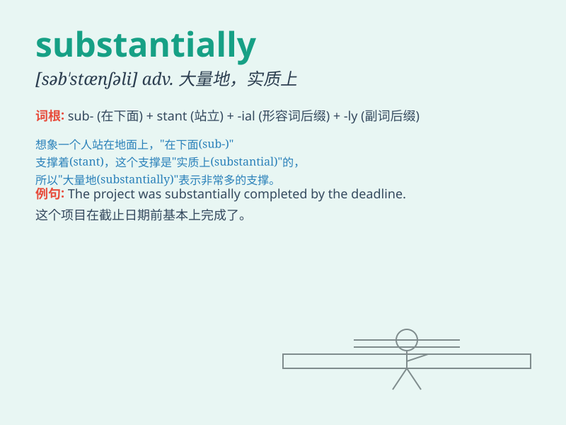

## substantially

**英音:** _[səb\'stænʃ(ə)lɪ]_ **美音:**
_[səb\'stænʃəli]_

**译义:** *adv.充分地*

### 短语

+ **substantially different:** _实质上不同_

+ **substantially increase:** _大幅增加_

+ **substantially improve:** _大幅改善_

+ **substantially reduce:** _大幅减少_

+ **substantially change:** _大幅改变_

### 例句

#### 例句1

> **The company\'s profits have increased substantially this
year.**

**中文翻译:** 这家公司今年的利润大幅增长。

**单词释义:** 大幅度地；显著地

#### 例句2

> **The new law will substantially change the way we do business.**

**中文翻译:** 新法律将极大地改变我们做生意的方式。

**单词释义:** 极大程度地

#### 例句3

> **The cost of living has risen substantially over the past few
years.**

**中文翻译:** 在过去几年里，生活成本大幅上升。

**单词释义:** 大大地；可观地

### 背诵小故事

> A poor man was struggling to survive. But after he got a job that
paid substantially high, his life changed completely. He could afford
nice food and a comfortable house.

**一个穷人在艰难求生。但在他得到一份薪水相当高的工作后，他的生活彻底改变了。他能买得起美味的食物和舒适的房子。**

### 图义

