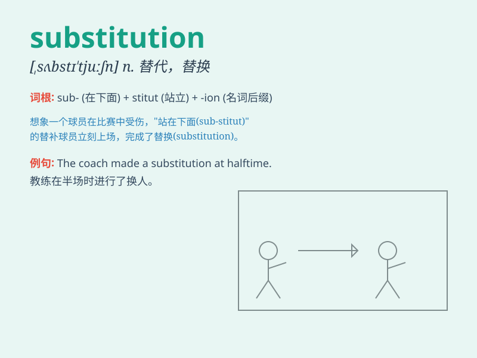

## substitution

**英音:** _[sʌbstɪ\'tjuːʃn]_ **美音:**
_[,sʌbstə\'tjʊʃən]_

**译义:** *n.代替,取代作用,代入法,置换*

### 短语

+ **substitution effect:** _替代效应_

+ **substitution rule:** _代换规则_

+ **substitution method:** _代入法；替换法_

+ **substitution reaction:** _取代反应；置换反应_

+ **substitution cipher:** _代换密码_

### 例句

#### 例句1

> **The substitution of artificial sweeteners for sugar is becoming
more common.**

**中文翻译:** 用人造甜味剂代替糖变得越来越常见。

**单词释义:** 代替；取代

#### 例句2

> **He made a substitution in the football team at halftime.**

**中文翻译:** 他在足球比赛中场时进行了人员替换。

**单词释义:** 替换；调换

#### 例句3

> **The substitution of local products for imported ones can boost
the economy.**

**中文翻译:** 用本地产品替代进口产品可以促进经济发展。

**单词释义:** 替代；替换

### 背诵小故事

> A football player got injured. So, a substitute player came in. The
substitution was timely and saved the game. It means replacing one
person or thing with another.

**一名足球运动员受伤了。于是，一名替补球员上场了。这次替换很及时，挽救了比赛。它的意思是用一个人或物代替另一个。**

### 图义

