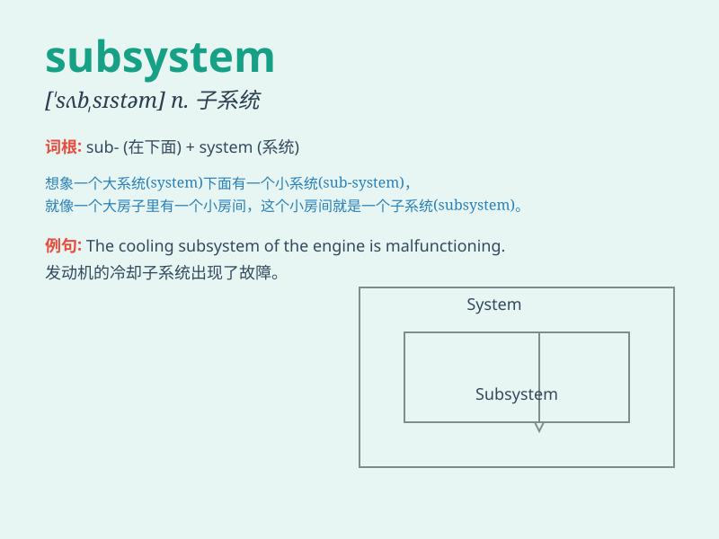

## subsystem

**英音:** _[\'sʌbsɪstəm]_ **美音:** _[sʌb\'ssɪstəm]_

**译义:** *n.次要系统,子系统*

### 短语

+ **communication subsystem:** _通信子系统_

+ **control subsystem:** _控制子系统_

+ **power subsystem:** _电源子系统_

+ **monitoring subsystem:** _监测子系统_

+ **data processing subsystem:** _数据处理子系统_

### 例句

#### 例句1

> **The computer subsystem crashed, causing a major disruption.**

**中文翻译:** 计算机子系统崩溃了，造成了重大的干扰。

**单词释义:** 子系统

#### 例句2

> **The new subsystem improved the efficiency of the manufacturing
process.**

**中文翻译:** 新的子系统提高了制造过程的效率。

**单词释义:** 子系统

#### 例句3

> **We need to upgrade the security subsystem to protect our
data.**

**中文翻译:** 我们需要升级安全子系统以保护我们的数据。

**单词释义:** 子系统

### 背诵小故事

>
想象一个大工厂，里面有很多不同的部分。其中有一部分专门负责生产特定的零件，这一部分就像是一个\'subsystem\'，是大系统中的一个小分支、子系统。

**想象一个大工厂里负责特定生产的部分来理解子系统这个单词**

### 图义

