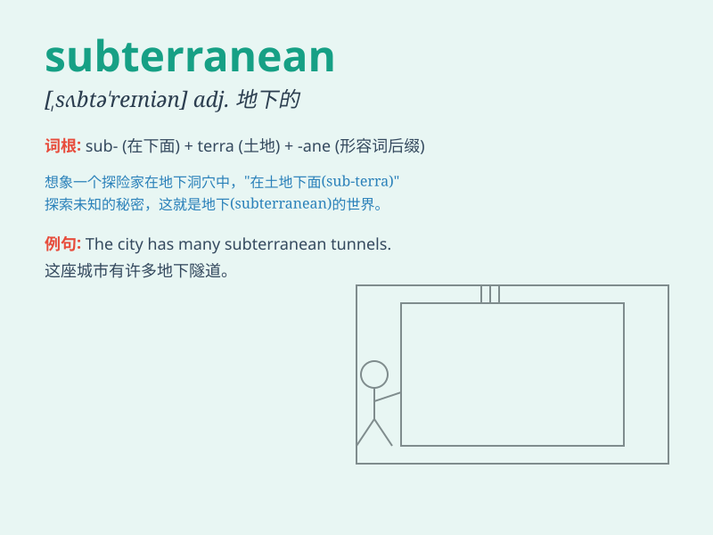

## subterranean

**英音:** _[,sʌbtə\'reɪnɪən]_ **美音:**
_[,sʌbtə\'renɪən]_

**译义:** *adj.地下的*

### 短语

+ **subterranean cave:** _地下洞穴_

+ **subterranean passage:** _地下通道_

+ **subterranean water:** _地下水_

+ **subterranean chamber:** _地下室_

+ **subterranean mine:** _地下矿井_

### 例句

#### 例句1

> **The miners were working in a subterranean tunnel.**

**中文翻译:** 矿工们正在地下隧道里工作。

**单词释义:** 地下的

#### 例句2

> **The city has a subterranean parking lot.**

**中文翻译:** 这个城市有一个地下停车场。

**单词释义:** 地下的

#### 例句3

> **Some animals make their homes in subterranean caves.**

**中文翻译:** 一些动物在地下洞穴里安家。

**单词释义:** 地下的

### 背诵小故事

> A brave explorer was on a quest to find a lost treasure. He followed
a mysterious map and ended up in a subterranean cave. It was dark and
full of unknown dangers, but he persisted.

**一位勇敢的探险家正在寻找失落的宝藏。他根据一张神秘的地图，最终来到了一个地下洞穴。那里黑暗且充满未知的危险，但他坚持不懈。**

### 图义

