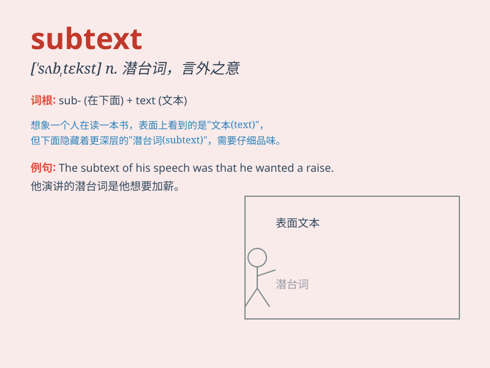

## subtext

**英音:** _[ˈsʌbtekst]_ **美音:** _[ˈsʌb.tɛkst]_

**译义:** *n. 隐含的意义；潜台词；未直接表达但被感受到的意思*

### 短语

+ **hidden subtext:** _隐藏的潜台词_

+ **underlying subtext:** _潜在的潜台词_

+ **emotional subtext:** _情感潜台词_

+ **political subtext:** _政治潜台词_

+ **cultural subtext:** _文化潜台词_

### 例句

#### 例句1

> **The subtext of her speech was a call for unity.**

**中文翻译:** 她演讲的潜台词是呼吁团结。

**单词释义:** 潜台词；潜在含义

#### 例句2

> **There is a subtext of sadness in his poem.**

**中文翻译:** 在他的诗中有悲伤的潜流。

**单词释义:** 潜在的意思；潜在的情绪

#### 例句3

> **The subtext of their conversation was that they were not
satisfied with the current situation.**

**中文翻译:** 他们谈话的潜台词是他们对当前的状况不满意。

**单词释义:** 潜在的意思；隐含的信息

### 背诵小故事

> Once upon a time, a detective was reading a mystery novel. He found
that beneath the obvious text (subtext), there were hidden clues. He
needed to understand the subtext to solve the case.

**从前，一位侦探在读一本悬疑小说。他发现，在明显的文字之下（潜台词），隐藏着线索。他需要理解潜台词才能破案。**

### 图义

