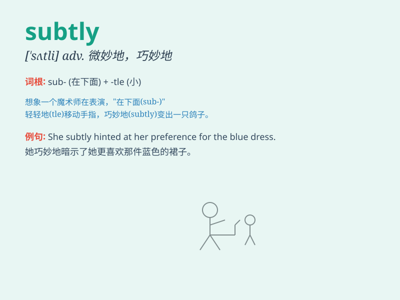

## subtly

**英音:** _[\'sʌtli]_ **美音:** _[\'sʌtli]_

**译义:** *adv.敏锐地,精细地,巧妙地*

### 短语

+ **subtly different:** _细微地不同_

+ **subtly influence:** _微妙地影响_

+ **subtly hint:** _巧妙地暗示_

+ **subtly change:** _微妙地改变_

+ **subtly shift:** _细微地转变_

### 例句

#### 例句1

> **She subtly changed the topic of conversation.**

**中文翻译:** 她巧妙地改变了谈话的主题。

**单词释义:** 巧妙地

#### 例句2

> **The lighting in the room subtly enhanced the mood.**

**中文翻译:** 房间里的灯光微妙地增强了氛围。

**单词释义:** 微妙地

#### 例句3

> **He subtly influenced her decision without her realizing it.**

**中文翻译:** 他在她未察觉的情况下微妙地影响了她的决定。

**单词释义:** 微妙地

### 背诵小故事

> A spy was trying to gather information subtly. He dressed like an
ordinary person and spoke softly, avoiding drawing attention. But a
detective noticed his subtly strange behavior and caught him.

**一名间谍试图巧妙地收集信息。他穿着像普通人，轻声说话，避免引起注意。但一名侦探注意到他微妙奇怪的行为并抓住了他。**

### 图义

